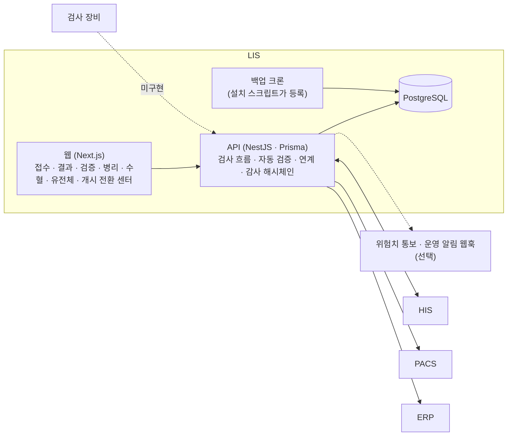

# LIS — 시스템 구성서

> 기준 버전 **1.56.18** · 기준 커밋 `ffb34e9d1dbc` · 구현 상태 `파일럿` — [매니페스트](../RELEASES/draft/manifest.md) 기준
> 사실 확인: 미확인 — 생태계 자료 측 조사 기준(시스템 담당 확인 전) · 새 설치본으로 따라가 보기 전

이 버전에서 무엇이 바뀌었는지는 [릴리즈 요약](../RELEASES/draft/systems/lis.md)에 있습니다.

## 1. 정체성과 계층

- **정의**: 진단검사 · 미생물 · 병리 · 수혈 · 유전체(분자진단 · NGS 포함)의 검사 전 과정을 다루는 검사정보시스템입니다. HIS 에서 검사 처방을 받아 결과를 돌려주고, 병리 영상은 PACS 와, 청구는 ERP 와 주고받습니다.
- **계층**: ③ 임상 부서. 구축 단계로는 [S3 임상 부서](../README.md#구축은-이렇게-진행됩니다)에서 붙입니다.
- **HIS 와의 관계**: 검사 처방과 결과는 FHIR 로 주고받습니다. HL7 v2 경로는 대체 경로로만 남아 있습니다(7절 `미구현` 행).
- **로그인**: LIS 자체 로그인을 씁니다. HIS 와의 서버 간 연결에는 HIS FHIR 접근용 클라이언트 자격과 연동 키를 설정합니다(6절). 서명 · 승인 주체는 요청 본문이 아니라 서버가 로그인 정보로 정합니다.
- **설치 단위**: 한 설치본이 한 기관입니다(사이트 = 서버 = DB).
- **버전 표기**: 정본은 `package.json` 의 1.56.18 이고, 태그 · API · 웹 패키지 · CHANGELOG 도 같습니다. 웹 화면이 보여 주는 버전 상수만 1.56.13 으로 뒤에 있습니다(매니페스트 등급 `표면`).

## 2. 구성도

연결마다 방향 · 목적 · 상태는 [7. 연동](#7-연동)에 있습니다.

## 3. 규모

| 항목(스냅샷 키) | 값 | 센 방법(요약) | 계측일 |
|---|---:|---|---|
| `systems.lis.counts.dataModels` | 84 | `apps/api/prisma/schema.prisma` 의 `model` 선언 수 | 2026-09-11 |
| `systems.lis.counts.apiEndpoints` | 356 | `apps/api/src/**/*.ts` 의 행 시작 HTTP 메서드 데코레이터 수 = 핸들러 수(테스트 제외) | 2026-09-11 |
| `systems.lis.counts.pages` | 41 | `apps/web/src/app/**/page.*` 수(레이아웃 · 오류 화면 · API 라우트 제외) | 2026-09-11 |
| `systems.lis.counts.e2eCases` | 470 | `apps/api/test/**/*.e2e-spec.ts` 의 `it` · `test` 선언 수(파일 1) — 선언 수이지 통과 수가 아님 | 2026-09-11 |

원본과 규칙 전문: [`data/scale-snapshot.json`](../data/scale-snapshot.json) · 기준 커밋 `ffb34e9d1dbc`.

## 4. 핵심 기능

| 영역 | 무엇을 하나 |
|---|---|
| 진단검사 | 처방 수신 → 접수 · 라벨 → 검체(분주 · 거부 · 재채취) → 결과(장비 결과 파일 입력 · 수기 입력) → 자동 검증 · 델타 체크 → 2차 검증 → 위험치 폐루프(통보 · 상향 · 복창 기록) → 보고 · HIS 회신 → 청구 캡처. 참고치가 없거나 단위가 맞지 않으면 자동 확정을 막고, 입력자와 검증자가 같으면 검증을 막습니다 |
| 미생물 | 배양 등록 → 그람 예비보고 → 동정 → 감수성(전문가 규칙) → 다제내성균 판정 · 격리 → 법정감염병 신고 기록(신고 서류 · 신고 번호가 있어야 완료) → 누적 항균제 감수성 통계 |
| 병리 | 접수 → 그로싱 → 블록 → 슬라이드(H&E · 특수 염색 · 면역조직화학) → 동결절편 복창 → 판독 → 구조화 보고 → 2단계 사인아웃 → 개정 · 추가 보고 → PACS 의 슬라이드 영상 조회 |
| 수혈 | 혈액형 · 항체 → 입고 · 유효기간 → 교차시험 자동 판정 → ABO 부적합을 막는 독립 판정 → 출고(동의 상태 확인) → 시행(2인 확인) → 부작용 조사 |
| 유전체 · 분자진단 · NGS | 동의 → 수탁 · 시퀀싱 → 변이 입력(VCF · 수기) → ACMG 기준 큐레이션 → 해석 확정 → 이차 소견 동의 게이트(동의가 없으면 건수조차 보여 주지 않음) → 보고서 서명 · 배포 → 재분류. 분자진단 판정 기준 · NGS 런 품질 기준 관리 |
| 품질 관리 | 내부 정도관리(Westgard 규칙 · Levey-Jennings) · 외부 정도관리 · 장비 목록 · 소요 시간(TAT)과 재검률 통계 |
| 거버넌스 · 개시 전환 | 반사 검사(Reflex) 승인 프로토콜(4-eyes) · 조직 결재 게이트 · 검사실 서명 기록 · 조직 결정 등록. **개시 전환 센터**에서 개시 체크리스트 · 개시 키 · 전환 실행을 한 화면에서 합니다. 시스템이 판정할 수 있는 항목은 사람이 완료로 찍지 못하고, 근거가 필요한 항목은 첨부 문서 없이 완료할 수 없습니다 |
| 파일럿 데이터 정리 | 시드가 만든 행만 지우고, 실제 환자 데이터가 감지되면 거부합니다. 요청과 승인을 다른 관리자가 각자 인증해 두 단계로 실행합니다 |
| 운영 · 감사 | 연계 감시 지표 · 실패 메시지 대기열과 재적재 · 다운타임 오더 · 외부 위탁. 변경과 민감 조회를 감사 기록(해시체인 · DB 트리거로 수정 차단)에 남기고, 보존 기간의 법정 하한을 설정 저장 때와 적용 때 모두 강제합니다. 권한은 기능 × 역할 매트릭스로 관리합니다 |

## 5. 설치 요구사항

| 항목 | 내용 | 근거 |
|---|---|---|
| 호스트 | Docker 와 compose v2 가 준비된 호스트. 설치 스크립트가 디스크 여유 10GB 이상을 확인합니다 | `infra/install/install.sh` |
| 런타임 | Node.js 20(컨테이너 이미지) · NestJS 11 · Prisma 6 · Next.js | Dockerfile · `package.json` |
| 데이터베이스 | PostgreSQL 16. 운영 compose 는 PostgreSQL · API · 웹 세 컨테이너입니다(개발 compose 에는 Redis 도 있음) | 저장소 compose |
| GPU | 필요 없습니다 | — |
| 설치 스크립트가 하는 일 | 비밀값을 무작위로 만들고, 마이그레이션 적용을 확인하고, 백업 크론을 등록하고, 관리자 초기 비밀번호를 한 번만 출력합니다. 기존 환경 파일은 덮어쓰지 않고 멈춥니다. 사이트 코드와 https 공개 주소를 인자로 받고, http 주소는 거부합니다 | 설치 스크립트 · [릴리즈 요약](../RELEASES/draft/systems/lis.md) |
| 설치 스크립트가 하지 않는 일 | 운영체제 · Docker 설치, 방화벽, TLS 인증서, DNS, 백업 대상 스토리지 마련 — 기관이 준비합니다 | 설치 스크립트 머리말 |
| 네트워크 | HL7 v2(MLLP) 구간(PACS 병리 워크리스트)은 원내 폐쇄망이나 상대 시스템과 합의한 전용 VPN 안에 두도록 설계돼 있습니다. 지표 엔드포인트는 루프백 · 사설 대역에서만 읽히므로, 더 좁혀야 하면 앞단 프록시에서 함께 제한합니다 | 저장소 수용 위험 문서 · 1.56.17 기록 |
| 같은 호스트에 다른 시스템이 있을 때 | compose 프로젝트 이름을 고정해 충돌을 막습니다 | 저장소 배포 문서 |
| 함께 설치해야 하는 것 | 검사 처방을 받으려면 HIS(FHIR). 병리 영상은 PACS, 청구는 ERP — 필요할 때 붙입니다 | — |

- **시드 프로파일** — `starter` · `demo` · `all`. 운영 설치는 `starter` 로 하고, 데모 환자 · 데모 계정은 `demo` 에만 있습니다.
- **배포** — 배포 스크립트가 E2E 게이트 통과를 먼저 요구하고, 빌드 캐시 없이 빌드합니다.

## 6. 주요 설정

값은 적지 않습니다. ✔ 는 **설치 전에 반드시 바꿀 것**입니다. 키 목록은 API · 웹 · 운영용 환경 변수 예시와 API 가 읽는 키에서 모았습니다.

| 키 | 뜻 | 기본값의 성격 | 설치 전 |
|---|---|---|:---:|
| `DATABASE_URL` · `DB_PASSWORD` | DB 연결 | 로컬 개발용 · 자리표시 | ✔ |
| `JWT_SECRET` · `JWT_EXPIRES` | LIS 로그인 토큰 서명 · 만료 | 자리표시(설치 스크립트가 무작위 생성) | ✔ |
| `PUBLIC_ORIGIN` · `CORS_ORIGIN` · `NEXT_PUBLIC_API_URL` | 공개 주소 · 허용 출처 · 웹이 부르는 API 주소 | 예시가 특정 주소 · 로컬 주소 | ✔ |
| `LIS_SITE_CODE` | 사이트 식별(승인 기록 결속) | 비우면 미설정 표시 — 설치 스크립트가 받습니다 | ✔ |
| `HIS_FHIR_BASE` · `HIS_FHIR_TOKEN_URL` · `HIS_CLIENT_ID` · `HIS_CLIENT_SECRET` · `HIS_FHIR_SCOPES` | HIS FHIR 접근(클라이언트 자격) | 예시 · 코드 기본값에 특정 설치본 주소 · 비밀값 | ✔ |
| `HIS_ORDER_POLL` · `HIS_REFLEX_POLL` · `HIS_REFLEX_RETRY` · `HIS_ORDER_TRANSPORT` · `HIS_HTTP_TIMEOUT_MS` | 오더 · 반사 검사 폴링과 전송 방식 | 비어 있음(기본 동작) | 확인 |
| `HIS_INTEGRATION_BASE` · `HIS_INTEGRATION_KEY` · `HIS_TARGET_TOKEN_SECRET` · `HIS_REFLEX_WEBHOOK_TOKEN` | HIS 커스텀 연동(카탈로그 · 결재 · 동의 참조) | 비어 있으면 그 연동을 쓰지 않습니다 · 비밀값 | ✔ |
| `HIS_MLLP_HOST` · `HIS_MLLP_PORT` | HIS HL7 대체 경로 | 비어 있음 | 확인 |
| `PACS_BASE` · `PACS_USER` · `PACS_PASS` · `PACS_MLLP_HOST` · `PACS_MLLP_PORT` | PACS 영상 조회 · 병리 워크리스트 송신 | 예시 주소가 특정 설치본 · 비밀값 | ✔ |
| `ERP_BILLING_URL` · `ERP_BILLING_SECRET` | ERP 청구 송신(HMAC 서명) | 비어 있음 · 비밀값 | ✔ |
| `CRITICAL_WEBHOOK_URL` · `CRITICAL_WEBHOOK_SECRET` · `CRITICAL_WEBHOOK_FULL_NAME` · `CRITICAL_RETRY` | 위험치 외부 통보 채널 | 비어 있음 | 결정 |
| `OPS_WEBHOOK_URL` · `OPS_MONITOR` | 운영 알림 · 연계 감시 | 비어 있음 | 결정 |
| `LIS_BACKUP_OFFSITE` | 오프사이트 백업 경로 | 비어 있음 | 결정 |
| `LIFECYCLE_PURGE` | 보존 기간이 지난 데이터 파기 | 꺼짐 — 법무가 보존 기간을 확정한 뒤 켭니다 | 결정 |
| `TRUST_PROXY_HOPS` | 앞단 프록시 단수 | 비어 있음 | 확인 |
| `BILLING_SWEEP` · `SENDOUT_STALE_DAYS` · `TRANSFUSION_RETURN_MINUTES` | 청구 재송신 · 외부 위탁 지연 · 혈액 반납 시간 | 코드 기본값 | 확인 |
| `SEED_PROFILE` · `NEXT_PUBLIC_DEMO` | 시드 프로파일 · 데모 표시 | 운영은 `starter` | 확인 |

외부 통보 채널 · 오프사이트 백업 경로 같은 사이트 값은 설치 뒤 넣고, 개시 전환 센터 체크리스트로 입력 순서와 완료를 확인합니다.

## 7. 연동

[연결 상태](../RELEASES/draft/compatibility.md)에서 LIS 가 한쪽 끝인 행을 그대로 옮겼습니다. 실제 호출로 `검증됨` 을 붙인 연결은 **10개**입니다 — HIS → sign 직원 신원 · 서명 · sign → HIS 서명 완료 통지 · HIS → sign 오더 서명 로그 봉인 · HIS → LIS 검사 오더 전달 · LIS → HIS 환자 조회 · HIS → ERP 직원 SSO · HIS ⇄ edu 직원 SSO · 공개키 조회 · 직원 명부 · 이수 기록(새 설치본끼리 확인 2026-09-14).

<!-- 연결 상태 표에서 옮긴 부분: 시작 -->

합계: 나가는 연결 12(`구현·미검증` 10 · `미구현` 2) · 들어오는 연결 5(`구현·미검증` 2 · `미구현` 3)

### 나가는 연결

| 방향 | 목적 | 프로토콜 | 상태 |
|---|---|---|---|
| LIS → HIS | 환자 성명 조회(오더 폴링 중 subject Patient 읽기) | FHIR R4 REST read | `검증됨` |
| LIS → HIS | 검사 결과 전달 — 결과 확정 시 DiagnosticReport(contained Observation) POST → HIS 스테이징 큐 | FHIR R4 REST create | `구현·미검증` |
| LIS → HIS | 검사 결과 HL7 ORU^R01 전송(MLLP) — 대체 경로 | HL7 v2.5.1 over MLLP(TCP) | `미구현` |
| LIS → HIS | Reflex 추가검사 오더 — LIS 가 ServiceRequest(draft)를 transaction Bundle 로 보내 HIS PreOrder(의사 승인 대기)로 수용 | FHIR R4 transaction Bundle(POST fhir/R4) | `구현·미검증` |
| LIS → HIS | Reflex 추가검사 오더 HL7 ORM^O01(MLLP) — HIS_ORDER_TRANSPORT=ORM 선택 시 | HL7 v2 over MLLP | `미구현` |
| LIS → HIS | Reflex PreOrder 승인·반려 상태 폴링(GET ServiceRequest/:id) | FHIR R4 REST read · 10분 폴링 | `구현·미검증` |
| LIS → HIS | 검사코드 카탈로그 반입(H1 · edi_code 정본 · 1:N 패널 · since 증분) | HTTPS GET JSON(커스텀) | `구현·미검증` |
| LIS → HIS | 조직 게이트 결재 상태 참조(HIS 전자결재 중계 EApprovalRelay) | HTTPS GET JSON(커스텀) | `구현·미검증` |
| LIS → HIS | 수혈 동의 상태 참조(FHIR Consent 파생 상태 · 출고 전 확인) | HTTPS GET JSON(Consent 모양 · 커스텀 EP) | `구현·미검증` |
| LIS → PACS | 병리 슬라이드 스캔 워크리스트 등록·취소(ORM^O01 NW/CA → PACS worklist → MWL) | HL7 v2.3 ORM^O01 over MLLP(TCP) | `구현·미검증` |
| LIS → PACS | 병리 WSI 뷰어 링크 해소 · QIDO 로 영상 도착 확인 · 열람 확인 기록 | HTTPS REST(PACS 로그인) + DICOMweb QIDO-RS + 뷰어 런처 URL | `구현·미검증` |
| LIS → ERP | 검사 청구 캡처(LIS 수량 → ERP 산정) · 상태 폴링 | HTTP POST ERP /api/v1/integration/lis/billing(202, 인박스 적재 li… | `구현·미검증` |

### 들어오는 연결

| 방향 | 목적 | 프로토콜 | 상태 |
|---|---|---|---|
| HIS → LIS | 검사 오더 전달 — LIS가 HIS FHIR ServiceRequest(active)를 5분 주기 증분 폴링 | FHIR R4 REST 검색(searchset) · 폴링 | `검증됨` |
| HIS → LIS | 검사 오더 취소 전파 — LIS가 status=revoked 를 같은 워터마크로 폴링해 LIS 오더·병리 케이스 취소 | FHIR R4 REST 검색 · 폴링 | `구현·미검증` |
| HIS → LIS | 검사 처방 HL7 OML^O21 수신(LIS inbound) — 대체 경로 | HL7 v2 메시지를 HTTP 본문으로(POST) | `미구현` |
| HIS → LIS | Reflex 승인·반려 웹훅(HIS→LIS push · 폴링 대안) | HTTPS POST JSON | `미구현` |
| 검사 장비(분석기) → LIS | 장비 결과 자동 수집(ASTM E1394 레코드 · 계기 CSV) → 코드 매핑 → 자동 평가 파이프라인 | HTTP POST(본문에 ASTM/CSV 원문) — ASTM 저수준 전송(E1381 직렬·TCP) 없음 | `미구현` |

<!-- 연결 상태 표에서 옮긴 부분: 끝 -->

시스템 담당 확인을 기다리는 연결은 이 장에 싣지 않았습니다([연결 상태](../RELEASES/draft/compatibility.md)).

## 8. 표준과 규제

**표준**

| 표준 | 쓰는 곳 |
|---|---|
| HL7 FHIR R4 | HIS 와의 검사 처방 · 결과 · 반사 검사 오더 |
| HL7 v2(ORM^O01) over MLLP | PACS 병리 스캔 워크리스트 · HIS 대체 경로(`미구현`) |
| DICOMweb QIDO-RS | PACS 병리 영상 도착 확인 |
| ASTM E1394 / CLSI LIS2-A2 · CSV | 검사 장비 결과 파서(장비 → LIS 자동 수집 연결은 `미구현`) |
| LOINC · SNOMED CT · ISBT 128 · HGVS/VCF · ACMG | 검사 · 미생물 · 수혈 · 유전체 코드와 해석 기준 |
| 청구 수가 코드 | ERP 청구 송신 |

코드와 미생물 판정 기준표는 기관이 반입하는 구조입니다. 이용 조건은 [THIRD_PARTY.md](../THIRD_PARTY.md#4-코드-마스터기준-데이터)를 봅니다.

**규제**

- 감사 기록의 법정 보존 하한 강제 · 법정감염병 신고 기록 · 이차 소견 동의 게이트는 관련 규정을 염두에 둔 설계입니다 — `대응 설계`. 외부 인증 · 승인 증빙은 없습니다.
- 법정감염병 신고는 신고 서류와 번호를 **기록**하는 것이며, 대외 기관으로 전송하지 않습니다.
- 인허가받은 의료기기가 아닙니다([의료 면책 고지](../DISCLAIMER.md)).

## 9. AI 사용

- **변이 해석 초안 보조** — 내장 지식기반과 ACMG 규칙으로 유전체 변이 해석 **초안을 만듭니다**. 외부 LLM · 클라우드로 데이터를 보내지 않으며, 초안은 판독 전문가가 검토 · 수정해 확정합니다.
- 자동 검증 · 델타 체크 · 교차시험 판정은 규칙 기반 판정입니다.
- AI Server 와의 연결은 없습니다(연결 상태 표에 행이 없고, 설정 키에도 AI 연결 항목이 없음 · 2026-09-11 확인).

## 10. 한계와 대체 수단

| 한계 | 대체 수단 · 구축 기관이 할 일 |
|---|---|
| **검사 장비 → LIS 자동 수집**이 `미구현`입니다 — 결과 파서는 있지만 장비의 저수준 전송(직렬 · TCP)을 받는 부분이 없습니다 | 장비와 LIS 사이에 인터페이스 중계 장치를 두거나, 결과 파일 입력 · 수기 입력으로 운영합니다 |
| **HL7 v2 대체 경로**(HIS 구간)가 `미구현`입니다 | FHIR 주 경로를 씁니다. 다운타임에는 다운타임 오더 절차를 씁니다 |
| **한 설치본 = 한 기관**입니다 | 기관마다 설치본을 따로 둡니다 |
| 웹 화면에는 자동 테스트 하네스가 없습니다(API E2E · lint 게이트로 회귀를 잡음) | 개시 전 리허설에서 화면 흐름을 사람이 확인합니다 |
| 보존 기간이 지난 데이터 파기는 꺼져 있습니다 | 법무가 보존 기간을 확정한 뒤 켭니다(결정 · 개시 체크리스트 항목) |
| 파일럿 기간에 **다른 시스템으로 보낸 데이터**는 LIS 정리 기능이 지우지 않습니다 | 개시 체크리스트의 별도 항목으로 상대 시스템과 함께 정리합니다 |
| 화면 표기용 버전 상수가 패키지 버전과 따로 있습니다 | 버전을 올릴 때 함께 바꿉니다 |

## 11. 소스 · 라이선스 표기 · 확인일

| 항목 | 값 |
|---|---|
| 소스 링크 | 정리 중 |
| 저장소 라이선스 표기 | 독점(`LICENSE`) · UNLICENSED(비공개 선언 · `package.json`) · 독점(`README.md`) — 목표는 MIT, 정리 전([매니페스트](../RELEASES/draft/manifest.md)) |
| 제3자 구성요소 | [THIRD_PARTY.md](../THIRD_PARTY.md) — PostgreSQL · Redis · 코드 마스터 |
| 기준 커밋 | `ffb34e9d1dbc` (2026-09-09 · [`data/base-commits.json`](../data/base-commits.json)) |
| 확인일 | 2026-09-11 — 기준 커밋의 compose · 환경 변수 예시 · 설치 스크립트 · API 가 읽는 키에서 **키 이름만** 읽었습니다 |
| 사실 확인 | 시스템 담당 확인 전 · 새 설치본으로 따라가 보기 전 |
