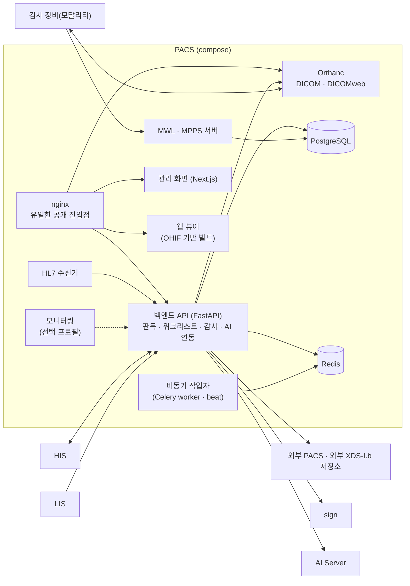

# PACS — 시스템 구성서

> 기준 버전 **v13.48** · 기준 커밋 `532a8ed13e87` · 구현 상태 `통합` — [매니페스트](../RELEASES/draft/manifest.md) 기준
> 사실 확인: 미확인 — 생태계 자료 측 조사 기준(시스템 담당 확인 전) · 새 설치본으로 한 번 따라가 봄(2026-09-14 · 개발 PC · GPU 없음 · 격리 네트워크 — [결과](../README.md#새-설치본으로-따라가-본-결과))

이 버전에서 무엇이 바뀌었는지는 [릴리즈 요약](../RELEASES/draft/systems/pacs.md)에 있습니다.

## 1. 정체성과 계층

- **정의**: 영상 서버(Orthanc) · 웹 뷰어 · 판독 워크플로 · 관리 화면 · AI 연동을 갖춘 웹 PACS 입니다. 모달리티 워크리스트와 HL7 v2 오더 수신으로 검사 흐름을 잇고, 판독 서명은 sign 에 맡깁니다.
- **계층**: ③ 임상 부서. 구축 단계로는 [S3 임상 부서](../README.md#구축은-이렇게-진행됩니다)에서 붙입니다. 이미 쓰는 PACS 가 있으면 이 PACS 대신 표준 프로토콜로 연결하는 선택도 있습니다.
- **로그인**: 직원은 **HIS 가 발급한 토큰을 공개키로 검증**해 들어옵니다(HIS 공통 SSO). 서비스 계정(LIS 연동 등)은 PACS 로그인을 씁니다. 역할 기반 접근 제어로 환자 정보를 돌려주는 조회를 임상 역할로 묶습니다.
- **제3자 소스로 만든 부분**: 웹 뷰어는 OHIF Viewer(v3.12.0 태그) 소스를 받아 패치 · 자체 확장 · 한국어 번역을 얹어 빌드하고, Cornerstone3D 를 함께 묶습니다(둘 다 MIT). 영상 서버 Orthanc 와 플러그인은 GPL · AGPL 계열이며 별도 컨테이너로 씁니다([THIRD_PARTY](../THIRD_PARTY.md)).
- **버전 표기**: 코드에 버전 선언이 없어 릴리즈 기록 파일명의 가장 높은 번호(v13.48)를 정본으로 씁니다. 마지막 태그는 v11.2 이고, 관리 화면 패키지와 백엔드 API 문서는 2.0.0 을 내보냅니다(매니페스트 등급 `주요`).

## 2. 구성도

연결마다 방향 · 목적 · 상태는 [7. 연동](#7-연동)에 있습니다.

## 3. 규모

| 항목(스냅샷 키) | 값 | 센 방법(요약) | 계측일 |
|---|---:|---|---|
| `systems.pacs.counts.apiEndpoints` | 475 | `backend/app/**` 에서 FastAPI 라우터 변수의 HTTP 데코레이터 수 = 핸들러 수(웹소켓 제외) | 2026-09-11 |
| `systems.pacs.counts.apiWebsockets` | 3 | 같은 범위의 웹소켓 데코레이터 수 — 위 수에 더하지 않음 | 2026-09-11 |
| `systems.pacs.counts.pages` | 47 | 관리 화면 `admin/src/app/**/page.*` 수(레이아웃 · 오류 화면 · API 라우트 제외) | 2026-09-11 |
| `systems.pacs.counts.testCases` | 166 | `backend/tests/**/test_*.py` 의 테스트 함수 선언 수(파일 14) — 선언 수이지 통과 수가 아님 | 2026-09-11 |
| `systems.pacs.counts.e2eCases` | 132 | `e2e/tests/**/*.spec.*` 의 `it` · `test` 선언 수(파일 23) | 2026-09-11 |

원본과 규칙 전문: [`data/scale-snapshot.json`](../data/scale-snapshot.json) · 기준 커밋 `532a8ed13e87`.

## 4. 핵심 기능

| 영역 | 무엇을 하나 |
|---|---|
| 영상 저장 · 교환 | DICOM DIMSE(C-STORE · C-FIND · C-MOVE · C-ECHO)와 DICOMweb(QIDO-RS · WADO-RS · STOW-RS — 토큰 게이트 뒤). 모달리티 워크리스트(MWL) · MPPS · Storage Commitment, HL7 v2 오더 · ADT 수신 → 워크리스트. 주요 영상 표시(KOS), 외부 PACS 조회 · 가져오기, 업로드 센터 · 환자 업로드 포털 · 키오스크(CD · USB), IHE XDM 패키지 내보내기 |
| 비표준 DICOM 정규화 | 검증 규칙과 자동 수정(원본 백업 · 되돌리기 · 이력), 영상 출처 분류(원내 · 외부 · 환자 · 키오스크 · 연구), 압축 파일 해제 상한(전체 · 항목별 · 개수) |
| 판독 워크플로 | 워크리스트 · 판독 배정(근무표 · 부하 분산) · SLA 상향 · 예비판독(전공의 → 전문의) · 재촬영 요청 · 판독문 서식 · 협진 · 응급 보드 · 위급 소견 실시간 알림 · 판독 소요 시간 통계 |
| 웹 뷰어 | 2D 판독 · MPR · 측정 · 주석 · 행잉 프로토콜(이전 검사 비교) · 3D 볼륨 렌더링, 판독문 패널 · AI 패널을 둔 판독 모드, 두 번째 모니터 창, 병리 슬라이드(WSI) 현미경 모드와 DICOM 표준 주석 |
| AI 보조 | 판독문 초안 자동 생성 · 뷰어 AI 패널(영상 분석 · 이전 검사 비교 · 소견 설명 초안) · 영상 자동 선별 알림 · AI 결과의 DICOM SR · SEG 저장 · AI 거버넌스(모델별 성능 추세 · 판독의 수용률 · 드리프트 감지). 연산은 AI Server 가 합니다(9절) |
| 보안 · 감사 | 역할 기반 접근 제어 · 응급 열람(Break-the-Glass) · 추가만 되는 감사 기록(DB 트리거) · 국제 표준 감사 메시지(IHE ATNA) 송신(선택) · 비식별화 엔진 · 연구 코호트 · IRB 승인 등록부 |
| 연동 | HIS 환자 매핑(MRN ↔ DICOM PatientID) · 영상 오더 동기화 · 환자 병합 재귀속 · FHIR R4 자원 래퍼, sign 판독문 전자서명 · 환자 동의서 서명(PACS 는 키를 갖지 않음), LIS 병리 워크리스트 · 영상 도달 확인, 환자 결과 내보내기(일회용 게이트웨이의 암호화 패키지) |
| 운영 | 백업 · 재해 복구 스크립트(DB 암호화 백업 · DICOM 하드링크 증분 스냅샷 · 복구 리허설), 모니터링(선택), 프레임 캐시와 예측 프리페치, 운영 BI 보고(판독 KPI · 월간 보고) |

## 5. 설치 요구사항

| 항목 | 내용 | 근거 |
|---|---|---|
| 호스트 | Docker Engine 24 이상 · Compose v2. 저장소 README 는 메모리 8GB 이상 · 디스크 50GB 이상 · 운영용 도메인과 TLS 인증서를 적습니다(이 자료에서 계측하지 않은 값) | 저장소 README |
| 런타임 | 백엔드 · 작업자 Python 3.12 · FastAPI · Celery, 관리 화면 Node.js 22 · Next.js, 웹 뷰어 정적 파일(nginx 이미지) | 각 Dockerfile |
| 데이터베이스 · 캐시 | PostgreSQL 16 · Redis 7 | compose 이미지 태그 |
| 영상 서버 | Orthanc(이미지 태그 고정 · 코어 · 플러그인 판본은 확인 필요 — [THIRD_PARTY 주 1](../THIRD_PARTY.md#1-별도-서비스로-쓰는-제3자-서버)) | compose |
| GPU | PACS 자체에는 필요 없습니다. AI 연산은 AI Server 가 합니다 | — |
| 구성 | Orthanc · PostgreSQL · Redis · 백엔드 API · 작업자(worker · beat) · MWL/MPPS 서버 · HL7 수신기 · 관리 화면 · 웹 뷰어 · nginx 를 compose 로 올립니다. 모니터링(Prometheus · Alertmanager · Grafana · exporter)은 `monitoring` 프로필로 켭니다 | `docker-compose.yml` |
| 웹 뷰어 빌드 | 저장소 빌드 스크립트가 OHIF 소스를 받아 패치 · 확장 · 번역을 얹고 정적 파일을 만듭니다. 빌드하는 곳에서 소스를 받을 수 있어야 합니다. 다시 빌드 · 배포하면 [THIRD_PARTY §2](../THIRD_PARTY.md#2-소스를-가져와-고친-제3자-코드)의 고지 조건을 확인합니다 | 저장소 README |
| 저장소(디스크) | DICOM 영상 볼륨이 가장 큽니다. 그 밖에 DB · 동의서 · 내보내기 임시 볼륨과 백업(하드링크 증분 스냅샷) | compose 볼륨 |
| 네트워크 | 웹 · API 는 nginx 한 곳으로만 공개합니다. 모달리티용 DICOM 포트 · HL7 수신 포트는 원내망에 둡니다. **HL7 수신 허용 대역은 앱 설정과 호스트 방화벽을 함께 맞춥니다** — 한쪽만 바꾸면 연결이 조용히 끊깁니다 | compose · v13.48 기록 |
| 함께 설치해야 하는 것 | 직원 로그인에 HIS(공개키 목록). 판독 서명에 sign, AI 보조에 AI Server — 필요할 때 붙입니다 | — |

- 비동기 작업자는 코드가 이미지에 들어가므로, 작업자 코드가 바뀌면 이미지를 다시 빌드합니다.
- 오프사이트 백업 대상은 설정해야 켜집니다. 암호화 백업의 패스프레이즈는 서버 밖에도 보관합니다.

## 6. 주요 설정

값은 적지 않습니다. ✔ 는 **설치 전에 반드시 바꿀 것**입니다. 키 목록은 환경 변수 예시와 백엔드 설정 모듈(`backend/app/core/config.py` — 필드 79개)에서 읽었습니다.

| 키 | 뜻 | 기본값의 성격 | 설치 전 |
|---|---|---|:---:|
| `INSTITUTION_NAME` · `INSTITUTION_ID` · `TIMEZONE` | 기관 이름 · 식별자 · 시간대 | 저장소 기본값 | ✔ |
| `BASE_URL` | PACS 공개 주소 | 코드 기본값이 특정 설치본 주소 | ✔ |
| `POSTGRES_USER` · `POSTGRES_PASSWORD` · `POSTGRES_DB` · `DATABASE_URL` · `REDIS_PASSWORD` | DB · 캐시 | 자리표시 · 비밀값 | ✔ |
| `SECRET_KEY` | 백엔드 서명 비밀 | 필수 · 비밀값 | ✔ |
| `ORTHANC_URL` · `ORTHANC_USERNAME` · `ORTHANC_PASSWORD` · `ORTHANC_AET` · `ORTHANC_BASIC_AUTH` | 영상 서버 접속 · AE 타이틀 | 비밀값 포함 | ✔ |
| `MWL_AE_TITLE` · `DICOM_BIND` · `ORTHANC_DICOM_PORT` · `MWL_PORT` | 모달리티가 붙는 DICOM 노드 | 저장소 기본값 | 결정 |
| `ORTHANC_DICOM_TLS_ENABLED` · `ORTHANC_DICOM_TLS_MUTUAL` | 모달리티 구간 DICOM TLS | 꺼짐 | 결정 |
| `HL7_PORT` · `HL7_ALLOWED_PEERS` · `HL7_ALLOWED_FACILITIES` | HL7 수신과 허용 대역 · 기관 | 비어 있음 — 호스트 방화벽과 함께 정합니다 | ✔ |
| `HIS_SSO_ENABLED` · `HIS_JWKS_URL` · `HIS_JWT_ISSUER` · `HIS_JWT_AUDIENCE` | 직원 로그인 — HIS 토큰을 공개키로 검증 | SSO 켜짐 · 주소는 비어 있음 | ✔ |
| `HOSPITALRUN_AUTH_SECRET` | HIS 연동용 비밀값 | 비어 있음 · 비밀값 | ✔ |
| `HIS_INBOUND_ENABLED` · `HIS_INBOUND_API_KEY` | HIS 가 보내는 워크리스트 등록 받기 | 꺼짐 — 켜야 받습니다 | 결정 |
| `HOSPITALRUN_DB_URL` | HIS DB 직접 접속(오더 동기화 · 판독 결과 반영 — 7절) | 비어 있음 · 비밀값 포함 | ✔ |
| `AI_SERVER_URL` · `AI_API_KEY` · `AI_MEDICAL_KEY` · `AI_ENDPOINT_ALLOWLIST` | AI Server 연결 · 호출 허용 목록 | 주소 기본값이 특정 설치본 주소 · 비밀값 | ✔ |
| `SCREENING_ENABLED` · `SCREENING_ACTIONABLE_CONFIDENCE` · `SCREENING_MAX_PER_SCAN` | 영상 자동 선별 | **켜짐** | 끔 → 결정 |
| `GOVERNANCE_AUTO_QUARANTINE` 와 `GOVERNANCE_*` 임계값 | 드리프트 확인 시 모델 자동 격리 | 꺼짐 | 결정 |
| `ai_auto_draft` (DB 설정 · 관리 API) | 검사 완료 시 AI 예비 판독문 초안 · 대상 모달리티 | 꺼짐 — 설정 변경은 전후 값과 함께 감사 기록 | 결정 |
| `PREFETCH_ENABLED` · `PREFETCH_WARM_BASE_URL` · `PREFETCH_*` | 프레임 캐시 예열 · 예측 프리페치 | 켜짐 · 예열 주소 기본값이 특정 설치본 주소 | ✔ |
| `SIGN_SERVICE_ENABLED` · `SIGN_SERVICE_URL` · `SIGN_SERVICE_API_KEY` · `SIGN_SERVICE_CALLBACK_URL` · `SIGN_PORTAL_BASE_URL` | sign 연결(판독 서명 · 동의서) | 꺼짐 · 주소 기본값이 특정 설치본 주소 | ✔ |
| `PATIENT_EXPORT_ENABLED` · `PATIENT_EXPORT_SECRET` · `PATIENT_VIEW_ENABLED` | 환자 결과 내보내기 · 환자 열람 | 꺼짐 · 비밀값(HIS 쪽과 같은 값) | 결정 |
| `ATNA_ENABLED` · `ATNA_HOST` · `ATNA_PORT` · `ATNA_TRANSPORT` · `ATNA_SOURCE_ID` · `ATNA_ENTERPRISE_SITE_ID` | IHE ATNA 감사 송신 | 꺼짐 | 결정 |
| `XDSI_SUBMIT_ENABLED` · `XDSI_REPOSITORY_ENDPOINT` · `XDSI_SOURCE_OID` | 기관 간 영상 교환(XDS-I.b) | 꺼짐 | 결정 |
| `RETENTION_YEARS` · `DISK_WARN_PCT` · `DISK_CRIT_PCT` · `ALERTMANAGER_WEBHOOK_TOKEN` | 보존 기간 · 디스크 경보 | 숫자 기본값 · 비밀값 | 확인 |
| `MAX_UPLOAD_BYTES` · `MAX_ZIP_EXTRACT_BYTES` · `MAX_ZIP_MEMBER_BYTES` · `MAX_ZIP_ENTRIES` 등 | 업로드 · 압축 해제 상한 | 코드 기본값 | 확인 |
| `CELERY_CONCURRENCY` · `CELERY_AI_CONCURRENCY` | 작업자 동시성 | 숫자 기본값 | 확인 |
| `GRAFANA_ADMIN_USER` · `GRAFANA_ADMIN_PASSWORD` | 모니터링 관리자 | 자리표시 | ✔ |
| `NGINX_HTTP_PORT` · `NGINX_HTTPS_PORT` 등 `*_PORT` | 게시 포트 | 표준 포트 | 확인 |

## 7. 연동

[연결 상태](../RELEASES/draft/compatibility.md)에서 PACS 가 한쪽 끝인 행을 그대로 옮겼습니다. HIS 쪽 웹 환자 포털(`HIS(환자 포털)`)에서 오는 행도 들어오는 연결에 넣었습니다. 실제 호출로 `검증됨` 을 붙인 연결은 **16개**입니다 — HIS → sign 직원 신원 · 서명 · sign → HIS 서명 완료 통지 · HIS → sign 오더 서명 로그 봉인 · HIS → LIS 검사 오더 전달 · LIS → HIS 환자 조회 · LIS → HIS 검사 결과 전달 · HIS → LIS 오더 취소 전파 · HIS → ERP 직원 SSO · HIS ⇄ edu 직원 SSO · 공개키 조회 · 직원 명부 · 이수 기록 · edu ⇄ sign 이수증 서명 · 완료 통지 · ERP ⇄ sign 외주 계약 서명 · 완료 통지(새 설치본끼리 확인 2026-09-14~15).

<!-- 연결 상태 표에서 옮긴 부분: 시작 -->

합계: 나가는 연결 10(`구현·미검증` 8 · `미구현` 2) · 들어오는 연결 10(`구현·미검증` 7 · `미구현` 2 · `판정 불가` 1)

### 나가는 연결

| 방향 | 목적 | 프로토콜 | 상태 |
|---|---|---|---|
| PACS → HIS | 판독 결과 반영 — PACS 가 HIS DB 에 imaging_results UPSERT + orders.status=COMPLETED 직접 쓰기 | PostgreSQL 직접 접속(SQL) | `구현·미검증` |
| PACS → HIS | 영상 오더 → PACS 워크리스트 동기화(HIS DB 읽기 전용 · 관리자 온디맨드) · 환자 병합 재조정 | PostgreSQL 직접 접속(읽기) | `구현·미검증` |
| PACS → HIS | 판독 결과 HL7 ORU^R01 송신 | HL7 v2 over MLLP | `미구현` |
| PACS → sign | 판독보고서 STAFF 전자서명(판독의 본인 서명) — 판독 서명 구간 | PACS 화면이 HIS staff-token(aud=sign) 발급 → PACS 백엔드 POST /api/v… | `구현·미검증` |
| PACS → sign | 영상·조영제 동의서 환자 서명(포털 링크·알림) | HTTP POST /v1/certificates/enroll(환자·대리인) · /v1/requests · /… | `구현·미검증` |
| PACS → AI Server | 영상 AI 보조(판독 보조·사전점검·비교 판독·구조화 판독문) · 텍스트 보조(요약·분석·설명·초안·참고·자동기록) · 예측·코드매핑 · 오케스트레이션 파이프라인 관리 · 정규화 AI · 추론(/a… | HTTPS REST(JSON · multipart) | `구현·미검증` |
| PACS → AI Server | AI 서버 가용성 감시(30분 주기 프로브 · 상태 전이 알림) | HTTPS GET /api/tags | `미구현` |
| PACS → 검사 장비(모달리티) | Modality Worklist C-FIND 응답 · MPPS N-CREATE/N-SET 로 워크리스트 상태 갱신 · C-STORE 수신(Orthanc) | DICOM DIMSE(MWL SCP · MPPS · Storage Commitment · C-STORE) | `구현·미검증` |
| PACS → 외부 PACS | 원격 DICOM 노드 조회·가져오기·보내기(C-ECHO/C-FIND/C-MOVE/C-STORE) | DICOM DIMSE(Orthanc 경유) | `구현·미검증` |
| PACS → 외부 XDS-I.b 저장소 | 영상 문서 세트 제출(ITI-41/RAD-68 · KOS 매니페스트) 및 XDM 오프라인 패키지 내보내기 | IHE XDS-I.b(SOAP 1.2 + MTOM) · XDM ZIP | `구현·미검증` |

### 들어오는 연결

| 방향 | 목적 | 프로토콜 | 상태 |
|---|---|---|---|
| HIS → PACS | 영상 오더 생성 시 PACS 워크리스트 자동 등록 + 실패분 재등록 | HTTPS REST JSON(POST /api/v1/worklist) | `구현·미검증` |
| HIS → PACS | 영상 조회 프록시 — 스터디·시리즈·판독 목록·워크리스트·대시보드·템플릿·AI 모델 목록 | HTTPS REST JSON(HIS api/v1/pacs/* → PACS /api/v1/*) | `구현·미검증` |
| HIS → PACS | 판독 작성·수정·서명 프록시(POST /reports · PATCH /reports/{id} · POST /reports/{id}/sign) | HTTPS REST JSON | `구현·미검증` |
| HIS → PACS | WADO 영상 바이트 중계(판독 워크스테이션 · 화면이 PACS 를 직접 부르지 않게) | HTTPS GET WADO-URI | `판정 불가` |
| HIS(환자 포털) → PACS | 환자 영상·판독 결과 내보내기(암호화 패키지 요청 → 상태 폴링 → 1회 수령) | HTTPS REST JSON + 1회용 게이트웨이 다운로드 | `구현·미검증` |
| HIS(환자 포털) → PACS | 환자 본인 영상·판독 목록·판독완료 알림·썸네일·판독 PDF 조회 | HTTPS REST JSON / 바이너리 | `구현·미검증` |
| HIS(환자 포털) → PACS | 환자 외부 영상(DICOM) 업로드 멀티파트 중계 | HTTPS POST multipart | `미구현` |
| HIS → PACS | 환자 인구정보·병합 HL7 ADT(IHE PIX Feed ITI-8 · Query ITI-9) | HL7 v2 ADT/QBP over MLLP | `미구현` |
| LIS → PACS | 병리 슬라이드 스캔 워크리스트 등록·취소(ORM^O01 NW/CA → PACS worklist → MWL) | HL7 v2.3 ORM^O01 over MLLP(TCP) | `구현·미검증` |
| LIS → PACS | 병리 WSI 뷰어 링크 해소 · QIDO 로 영상 도착 확인 · 열람 확인 기록 | HTTPS REST(PACS 로그인) + DICOMweb QIDO-RS + 뷰어 런처 URL | `구현·미검증` |

<!-- 연결 상태 표에서 옮긴 부분: 끝 -->

시스템 담당 확인을 기다리는 연결은 이 장에 싣지 않았습니다([연결 상태](../RELEASES/draft/compatibility.md)).

## 8. 표준과 규제

**표준**

| 표준 | 쓰는 곳 |
|---|---|
| DICOM DIMSE(C-STORE · C-FIND · C-MOVE · C-ECHO) · MWL · MPPS · Storage Commitment | 모달리티 · 외부 PACS |
| DICOMweb(QIDO-RS · WADO-RS · STOW-RS) · WADO-URI | 뷰어 · LIS · HIS 영상 중계 |
| DICOM KOS · SR · SEG · Microscopy Bulk Simple Annotations | 주요 영상 표시 · AI 결과 저장 · 병리 주석 |
| HL7 v2(ORM · ADT 수신) over MLLP | 영상 오더 · 병리 워크리스트 수신 |
| IHE XDS-I.b · XDM · PIX · ATNA | 기관 간 영상 교환 · 오프라인 패키지 · 환자 식별 교차 참조(모의 도메인에서 자체 검증까지) · 감사 송신 |
| HL7 FHIR R4 | HIS 자원 래퍼 |

**규제**

- 의료기기(의료영상저장전송장치) 인허가를 목표로 한 품질 · 위험관리 · 사용적합성 · 사이버보안 · 기술 문서가 저장소에 있습니다 — `대응 설계`. **허가 · 인증을 받은 제품이 아니며 증빙 번호가 없습니다**([의료 면책 고지](../DISCLAIMER.md)).
- 전자의무기록(EMR) 인증 기준의 보안성 · 상호운용성 항목과 PACS 구현을 대응시킨 표가 있습니다 — `대응 설계`.
- 임상 사용의 적합성 판단과 인허가는 구축 기관이 합니다.

## 9. AI 사용

- **하는 일** — 모두 판독의를 **돕는** 것입니다. 검사가 끝나면 예비 판독문 **초안을 만들고**(기본 꺼짐), 뷰어 AI 패널이 영상 분석 · 이전 검사 비교 · 소견 설명 초안을 보여 주고, 영상이 들어오면 조치가 필요할 수 있는 소견을 골라 알림으로 올립니다(영상 자동 선별).
- **사람의 확정** — AI 결과를 판독문 초안으로 옮길 수 있고, 판독의가 고쳐 확정합니다. 판독 서명은 판독의 본인이 sign 으로 합니다.
- **어디서 도나** — 연산은 [AI Server](ai-server.md) 가 합니다. 호출 목적지는 허용 목록(`AI_ENDPOINT_ALLOWLIST`)으로 제한합니다.
- **기본값**(2026-09-11 코드 확인) — 판독문 자동 초안과 드리프트 자동 격리는 꺼짐입니다. **영상 자동 선별(`SCREENING_ENABLED`)은 코드 기본값이 켜짐**입니다. 생태계 원칙("AI 기능은 기관 결정으로 켬")에 맞추려면 **설치할 때 끄고, 기관 결정 뒤에 켭니다.**
- **감독** — 모델별 성능 추세 · 판독의의 AI 결과 수용률 · 드리프트 감지. AI 결과는 표준 DICOM(SR · SEG)으로 남습니다.

## 10. 한계와 대체 수단

| 한계 | 대체 수단 · 구축 기관이 할 일 |
|---|---|
| **인허가받은 의료기기가 아닙니다** | 임상 사용의 적합성 판단과 인허가는 구축 기관이 합니다 |
| **판독 결과 HL7 송신 · 환자 인구정보 ADT(PIX Feed)** 가 `미구현`입니다 | HIS 와는 7절의 `구현·미검증` 경로(HIS DB 반영 · REST)를 씁니다. 다른 HIS 와 붙이려면 HL7 송신부를 추가합니다 |
| **기관 간 영상 교환(XDS-I.b) · 환자 식별 교차 참조(PIX)** 는 모의 도메인에서 자체 검증까지 했고, 실제 도메인 연결은 외부 조건입니다 | 연결할 교류 도메인의 규격 · 인증서를 받아 설정합니다 |
| **AI 서버 가용성 감시**가 `미구현`입니다 | AI Server 쪽 감시와 모니터링 프로필로 대신 봅니다 |
| 웹 뷰어 빌드 산출물에 묶이는 npm 패키지의 **고지 목록**이 아직 없습니다. Orthanc 이미지의 코어 · 플러그인 판본도 확인이 남아 있습니다 | 뷰어를 다시 빌드 · 배포하는 기관은 고지 목록을 따로 만들고 판본을 확인합니다([THIRD_PARTY](../THIRD_PARTY.md)) |
| 코드에 버전 선언이 없어 실행 중인 서비스에서 릴리즈 번호를 읽을 수 없습니다 | 배포 기록에 릴리즈 기록 파일 번호를 함께 남깁니다 |
| **특정 설치본 주소가 기본값**인 설정이 있습니다(6절 ✔) | 설치 전에 자기 기관 주소나 내부 주소로 바꿉니다 |

## 11. 소스 · 라이선스 표기 · 확인일

| 항목 | 값 |
|---|---|
| 소스 링크 | 정리 중 |
| 저장소 라이선스 표기 | 독점(`README.md`) — 목표는 MIT, 정리 전([매니페스트](../RELEASES/draft/manifest.md)) |
| 제3자 구성요소 | [THIRD_PARTY.md](../THIRD_PARTY.md) — Orthanc(GPL · AGPL) · OHIF · Cornerstone3D(MIT) · PostgreSQL · Redis · nginx · Prometheus · Grafana · exporter |
| 기준 커밋 | `532a8ed13e87` (2026-09-10 · [`data/base-commits.json`](../data/base-commits.json)) |
| 확인일 | 2026-09-11 — 기준 커밋의 compose · 환경 변수 예시 · 백엔드 설정 모듈에서 **키 이름과 기본값의 성격만** 읽었습니다 |
| 사실 확인 | 시스템 담당 확인 전 · 새 설치본으로 한 번 따라가 봄(2026-09-14 · 개발 PC · GPU 없음 · 격리 네트워크 — [결과](../README.md#새-설치본으로-따라가-본-결과)) |
