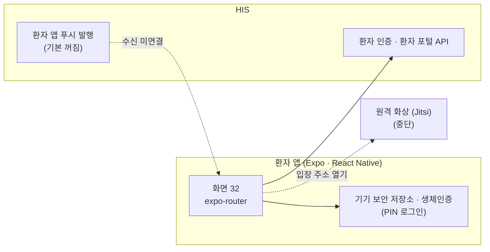

# 환자 앱 — 시스템 구성서

> 기준 버전 **v4.18.0** · 기준 커밋 `e9d303984f80` · 구현 상태 `개발` — [매니페스트](../RELEASES/draft/manifest.md) 기준
> 사실 확인: 미확인 — 생태계 자료 측 조사 기준(시스템 담당 확인 전) · 새 설치본으로 따라가 보기 전

이 버전에서 무엇이 바뀌었는지는 [릴리즈 요약](../RELEASES/draft/systems/patient-app.md)에 있습니다.

## 1. 정체성과 계층

- **정의**: 환자가 자기 예약 · 진료 기록 · 검사 · 영상 · 검진 결과 · 복약 · 수납 · 동의서를 보고, 예약 · 문진 · 서명 · 보호자 위임을 처리하는 모바일 앱입니다. HIS 의 환자 포털 API 를 쓰는 클라이언트입니다.
- **계층**: ② 환자 접점. 구축 단계로는 [S2 환자 접점](../README.md#구축은-이렇게-진행됩니다)에서 붙입니다. HIS 가 먼저 있어야 합니다.
- **자리**: HIS 저장소 안의 `apps/mobile`(Expo · React Native · expo-router)이며 HIS 와 함께 릴리즈됩니다. 자기 서버 · 데이터베이스가 없습니다.
- **구현 상태**: `개발` — **스토어에 배포되지 않았습니다.** 앱을 스토어에 올릴지는 HIS 결정 등록부의 허가권자 결정 항목입니다([사람 결정](../checklist/decisions.md)).
- **정본 복제**: 공용 패키지를 앱 번들러가 따라가지 못해, 필요한 정본(검사 판정 규칙 · 안내 문구 등)은 복제본으로 두고 저장소 검사가 원본과 대조합니다.
- **버전 표기**: HIS 와 같은 `HIS_VERSION`(v4.18.0)을 씁니다. 앱 패키지와 앱 설정 파일의 앱 버전(1.0.0)은 초기값 그대로이며, 스토어에 올릴 때 앱 버전 체계를 따로 정해야 합니다.

## 2. 구성도

앱이 부르는 서버는 HIS 하나입니다. 원격진료 입장 때만 화상 회의 주소를 외부 브라우저로 엽니다. 연결 상태는 [7. 연동](#7-연동)에 있습니다.

## 3. 규모

| 항목(스냅샷 키) | 값 | 센 방법(요약) | 계측일 |
|---|---:|---|---|
| `systems.patient-app.counts.screens` | 32 | `apps/mobile/app/**/*.tsx`(expo-router 라우트 파일) 중 레이아웃 파일(`_layout.tsx`) 제외 — HIS 저장소 정본 계측기 값을 옮김 | 2026-09-11 |

원본과 규칙 전문: [`data/scale-snapshot.json`](../data/scale-snapshot.json) · 기준 커밋 `e9d303984f80`.

## 4. 핵심 기능

| 영역 | 무엇을 하나 |
|---|---|
| 로그인 · 계정 | 전화번호 · 비밀번호 로그인, 기기 생체인증을 쓰는 PIN 로그인, 프로필 · 알림 설정 · 보호자 관리(위임 요청) |
| 예약 · 진료 | 예약 조회 · 취소, AI 예약 도우미, 진료 기록 목록, 입원 여정(타임라인 · 진료 · 회진 · 검사 기록), 원격진료 예약 · 조회 · 입장 |
| 검사 · 영상 · 검진 | 검사 결과(정상 · 이상 · 위급 판정은 공용 판정 규칙), 영상검사 목록과 판독 리포트, 검진 결과 상세 · 회차별 비교 · 셀프 예약 |
| 건강 관리 | 검사 추이 · 알레르기 · 수술 전 체크리스트 · 건강 메모, 만성질환 추이와 자가측정 기록, 복약 관리(서버가 준 복약 시간대 표시), AI 건강 요약 · 재진 권고 · 약물 상호작용 확인 |
| 문서 · 동의 · 수납 | 동의서 확인과 전자 서명, 문진표 작성, 제증명 · 서류 신청과 발급 상태, 수납 내역 · 요약 |
| 소통 · 알림 | 담당의 메시지 확인 · 답장, 알림 목록, 공지사항 |
| 내 정보 보호 | 내 기록 접근 이력 — 누가 언제 내 기록을 열었는지, 긴급 접근 사유와 사후 승인 여부까지 보여 줍니다 |

화면은 조회 실패를 "없음 · 0원 · 이상 없음"으로 바꿔 보여 주지 않고 실패로 말합니다. 진짜 빈 목록만 "없습니다"로 보여 줍니다.

## 5. 설치 요구사항

| 항목 | 내용 | 근거 |
|---|---|---|
| 개발 · 빌드 도구 | Node.js(HIS 저장소 기준 20 이상) · Expo SDK 56 · React Native 0.85 · expo-router | 앱 `package.json` |
| 서버 쪽 | 없습니다. HIS API(환자 인증 · 환자 포털)가 있어야 합니다 | [his.md](his.md) |
| 스토어 배포 | 앱 스토어 계정 · 앱 식별자 · 서명 키 · 스토어 빌드 설정은 저장소에 없습니다. 배포를 정한 기관이 준비합니다 | 앱 설정 파일(2026-09-11 확인) |
| 푸시 알림 | 앱 쪽 수신 코드는 있지만 알림 패키지가 앱 의존성에 없습니다. 서버 쪽은 푸시 발송 자격(HIS 환경 변수)과 발행 스위치가 필요합니다 | 앱 `package.json` · [his.md §6](his.md#6-주요-설정) |
| 함께 설치해야 하는 것 | HIS. 원격진료 화상을 쓰려면 화상 시스템([jitsi.md](jitsi.md)) | — |

- 앱은 **HIS 서버 배포와 무관**합니다. 앱 변경은 앱 빌드와 스토어(또는 기관 배포 경로)를 거쳐야 사용자 기기에 반영됩니다.
- 앱 폴더의 시험은 서버 계약 · 소스 대조 검사(Node 내장 러너)이며, 실기기 화면 시험은 없습니다.

## 6. 주요 설정

값은 적지 않습니다. ✔ 는 **설치 전에 반드시 바꿀 것**입니다.

**앱 빌드 설정**

| 키 · 위치 | 뜻 | 기본값의 성격 | 설치 전 |
|---|---|---|:---:|
| `EXPO_PUBLIC_API_URL` | HIS API 주소 | **코드 기본값이 특정 설치본 주소** — 지정하지 않으면 그 주소로 연결됩니다 | ✔ |
| `EXPO_PUBLIC_TELEHEALTH_URL` | 원격진료 화상 주소 | 코드 기본값이 특정 설치본 주소 | ✔ |
| 앱 설정 파일(`apps/mobile/app.json`)의 `expo.name` · `expo.slug` · `expo.scheme` | 앱 이름 · 식별 이름 · 딥링크 스킴 | 저장소 기본값 | ✔ |
| 같은 파일의 `expo.icon` · `expo.android.adaptiveIcon.*` · 앱 자산 이미지 | 앱 아이콘 · 스플래시 | 저장소 기본 이미지 | ✔ |
| 같은 파일의 `expo.version` | 앱 버전 | 초기값 1.0.0 | 결정 |

**HIS 쪽 설정**(환자 앱에 닿는 것 — HIS 관리 화면 · 환경 변수)

| 키 | 뜻 | 기본값의 성격 | 설치 전 |
|---|---|---|:---:|
| `notification.patientPush.enabled` | 환자 앱 푸시 전체 스위치(대외 발신) | 꺼짐 | 결정 |
| `FCM_SERVICE_ACCOUNT_JSON` (또는 `GOOGLE_APPLICATION_CREDENTIALS`) | 푸시 발송 자격 | 없으면 푸시가 꺼집니다 | 필요 시 |
| `portal.patientApp.jwtExpiresHours` | 환자 앱 로그인 유지 시간 | 숫자 기본값 | 확인 |
| `portal.signup.enabled` · `PATIENT_SIGNUP_IDENTITY` | 가입 허용 · 가입 본인확인 요구 | 가입 허용 · 본인확인 요구 — 본인인증 연동이 없어 실제 가입은 되지 않습니다(10절) | 확인 |
| `portal.selfBooking` · `portal.aiDrugExplain` · `portal.medicationReminder` · `portal.inpatientLife` | 셀프 예약 · 복약 AI 설명 · 복약 알림 · 입원 생활 기능 | 꺼짐 | 결정 |
| `mobile.patient.release` · `mobile.maintenance` | 앱 최소 · 최신 버전 정책 · 점검 모드 | 비어 있음 · 꺼짐 | 확인 |

## 7. 연동

[연결 상태](../RELEASES/draft/compatibility.md)에서 환자 앱이 한쪽 끝인 행을 그대로 옮겼습니다. 실제 호출로 `검증됨` 을 붙인 연결은 **6개**입니다 — HIS → sign 직원 신원 · 서명 · sign → HIS 서명 완료 통지 · HIS → sign 오더 서명 로그 봉인 · HIS → LIS 검사 오더 전달 · LIS → HIS 환자 조회 · HIS → ERP 직원 SSO(새 설치본끼리 확인 2026-09-14).

<!-- 연결 상태 표에서 옮긴 부분: 시작 -->

합계: 나가는 연결 2(`구현·미검증` 1 · `중단` 1) · 들어오는 연결 0(없음)

### 나가는 연결

| 방향 | 목적 | 프로토콜 | 상태 |
|---|---|---|---|
| 환자 앱 → Jitsi | 환자 앱 원격진료 입장 — 대기실 입장 기록(PATCH portal/telehealth/:id/join) 후 Jitsi URL 을 외부 열기 | 딥링크/브라우저 열기 | `중단` |
| 환자 앱 → HIS | 환자 인증(가입·로그인·PIN·토큰 갱신·기기 푸시 토큰·보호자·알림) 및 포털 기능(결과·영상·처방·수납·문진·동의서 서명·서류 발급·원격진료 예약·AI 질의 등) | REST(JSON) | `구현·미검증` |

### 들어오는 연결

없습니다.

<!-- 연결 상태 표에서 옮긴 부분: 끝 -->

시스템 담당 확인을 기다리는 연결은 이 장에 싣지 않았습니다([연결 상태](../RELEASES/draft/compatibility.md)).

## 8. 표준과 규제

- 표준 프로토콜을 직접 쓰지 않습니다. HIS 의 REST(JSON) 환자 포털 API 만 부릅니다.
- **스토어 배포 전에 기관이 정할 것** — 개인정보 처리방침 고지 주체 · 수집 항목 · 동의 범위, 스토어 심사 요건. 결정 등록부의 앱 배포 항목입니다([사람 결정](../checklist/decisions.md)).
- 동의서 전자 서명은 HIS 를 거쳐 sign 이 처리합니다([sign.md](sign.md)). 서명의 법적 효력 판단은 구축 기관과 법무가 합니다.
- AI 가 만든 건강 요약 · 권고는 참고 정보입니다([의료 면책 고지](../DISCLAIMER.md)).

## 9. AI 사용

- **AI 예약 도우미** — 대화로 예약을 **돕습니다**.
- **AI 건강 요약 · 재진 권고 · 약물 상호작용 확인** — 참고 정보의 **초안**을 보여 줍니다. 검증된 산출 도구가 없으면 점수를 만들지 않고 그 사유를 보여 줍니다.
- 화면의 AI 표기는 `AI(WeRU.B)` 입니다.
- AI 연산은 앱이 하지 않습니다. HIS 가 [AI Server](ai-server.md) 에 요청하며, 켜고 끄는 스위치도 HIS 쪽에 있습니다([his.md §9](his.md#9-ai-사용)).

## 10. 한계와 대체 수단

| 한계 | 대체 수단 · 구축 기관이 할 일 |
|---|---|
| **스토어 미배포** — 실기기에 설치할 배포본이 없습니다 | 결정 등록부의 앱 배포 항목을 정한 뒤 스토어 계정 · 앱 식별자 · 서명 키를 준비해 빌드합니다. 그전에는 HIS 의 **웹 환자 포털**을 씁니다 |
| **신규 가입** — 본인인증 연동이 없어 앱에서 가입할 수 없습니다. 가입 화면은 가입이 안 되는 이유와 대안을 안내합니다 | 본인인증 업체 연동과 문자 발송 제공자 등록을 먼저 합니다 |
| **본인확인 문자**는 문자 발송 제공자가 없어 모의 발송입니다 | 제공자를 연동합니다([his.md §10](his.md#10-한계와-대체-수단)) |
| **푸시 알림 수신**이 동작하지 않습니다 — 알림 패키지가 앱 의존성에 없고, 서버 쪽 발행도 기본 꺼짐입니다 | 앱에 알림 패키지와 설정을 추가하고, HIS 에서 푸시 발행을 켭니다(대외 발신 세 조건) |
| **PIN 로그인**은 이 기기에서 한 번 로그인해 전화번호가 저장돼 있어야 쓸 수 있습니다 | 첫 로그인은 전화번호 · 비밀번호로 합니다 |
| **원격진료 화상**은 별도 시스템(Jitsi)에 기대고, 현재 설치본은 동작하지 않습니다(연결 상태 `중단`) | 화상 시스템을 새로 구성합니다([jitsi.md](jitsi.md)) |
| **다국어** — 앱 화면은 한국어뿐입니다(2026-09-11 코드 확인) | 필요하면 앱 문구를 언어 팩 구조로 옮기는 작업이 필요합니다 |
| **실기기 화면 시험**이 없습니다 | 스토어 배포 전에 기관이 실기기 점검을 합니다 |
| 공용 판정 규칙 · 안내 문구를 바꾸면 앱의 복제본도 함께 바꿔야 합니다 | 저장소 대조 검사가 어긋남을 실패로 알립니다 |

## 11. 소스 · 라이선스 표기 · 확인일

| 항목 | 값 |
|---|---|
| 소스 링크 | 정리 중 |
| 저장소 라이선스 표기 | 독점(`README.md`) — 목표는 MIT, 정리 전([매니페스트](../RELEASES/draft/manifest.md)) |
| 기준 커밋 | `e9d303984f80` (2026-09-11 · HIS 저장소 · [`data/base-commits.json`](../data/base-commits.json)) |
| 확인일 | 2026-09-11 — 기준 커밋의 앱 `package.json` · 앱 설정 파일 · 환경 변수 사용처에서 **키 이름만** 읽었습니다 |
| 사실 확인 | 시스템 담당 확인 전 · 새 설치본으로 따라가 보기 전 |
