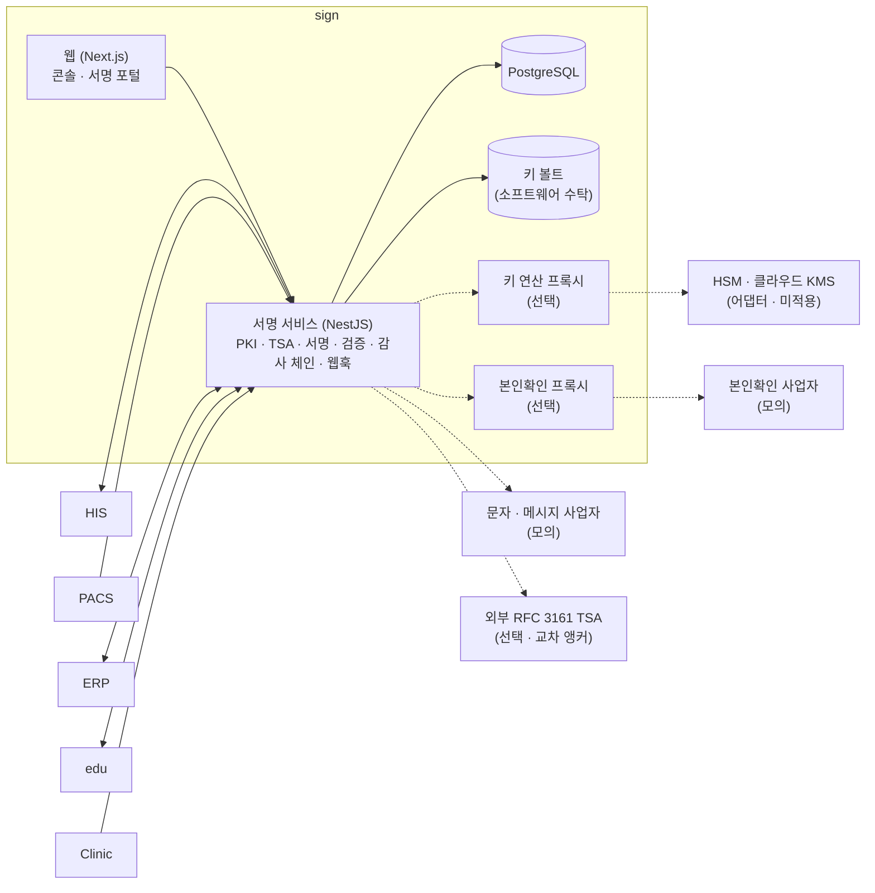

# sign — 시스템 구성서

> 기준 버전 **1.30.1** · 기준 커밋 `93f56d839c3f` · 구현 상태 `통합` — [매니페스트](../RELEASES/draft/manifest.md) 기준
> 사실 확인: 미확인 — 생태계 자료 측 조사 기준(시스템 담당 확인 전) · 새 설치본으로 따라가 보기 전

이 버전에서 무엇이 바뀌었는지는 [릴리즈 요약](../RELEASES/draft/systems/sign.md)에 있습니다.

## 1. 정체성과 계층

- **정의**: 의료 문서(동의서 · 판독 보고서 · 이수증)와 일반 계약서에 대해 "누가 · 언제 · 무엇에 서명했고, 그 뒤로 바뀌지 않았다"를 검증할 수 있게 만드는 독립 전자서명 서비스입니다. 자체 PKI(2단 CA) · RFC 3161 타임스탬프 · PAdES-LTA · CMS(CAdES) · 감사 해시체인으로 이루어집니다.
- **계층**: ④ 신뢰 계층. 구축 단계로는 [S4 신뢰 계층](../README.md#구축은-이렇게-진행됩니다)에서 붙입니다.
- **개인키는 sign 한 곳에만**: HIS · PACS · ERP · edu 같은 연동 시스템은 개인키를 갖지 않습니다. 인증서 발급과 서명은 sign 에서만 합니다.
- **로그인 · 인증**: 의료진 직접 서명은 **HIS 가 발급한 토큰을 공개키로 검증**해 서명자와 결속합니다. 연동 시스템은 시스템별 API 키로 부르고, sign 이 보내는 웹훅에는 HMAC 서명이 붙습니다. 콘솔은 역할 기반 권한(admin · operator · viewer)과 TOTP 2단계 인증을 씁니다.
- **버전 표기**: 정본은 `package.json` 의 1.30.1 이고, 태그 · API 명세 · CHANGELOG 도 같습니다. 웹 패키지 선언(1.25.0)만 뒤에 있습니다(매니페스트 등급 `참고`). 1.30.1 은 앱 코드 변경이 없는 릴리즈라 실행 코드는 1.30.0 과 같습니다.

## 2. 구성도

점선은 선택 구성이거나 기관이 계약해 붙이는 외부 서비스입니다. 연결마다 방향 · 목적 · 상태는 [7. 연동](#7-연동)에 있습니다.

## 3. 규모

| 항목(스냅샷 키) | 값 | 센 방법(요약) | 계측일 |
|---|---:|---|---|
| `systems.sign.counts.dataModels` | 14 | `prisma/schema.prisma` 의 `model` 선언 수 | 2026-09-11 |
| `systems.sign.counts.apiOperations` | 162 | OpenAPI 명세(`docs/openapi.json`)의 경로 아래 HTTP 메서드 항목 수(경로 144) | 2026-09-11 |
| `systems.sign.counts.apiEndpoints` | 162 | `src/**/*.ts` 의 행 시작 HTTP 메서드 데코레이터 수 = 핸들러 수(테스트 제외) | 2026-09-11 |
| `systems.sign.counts.pages` | 38 | `web/src/app/**/page.*` 수(레이아웃 · 오류 화면 · API 라우트 제외) | 2026-09-11 |

원본과 규칙 전문: [`data/scale-snapshot.json`](../data/scale-snapshot.json) · 기준 커밋 `93f56d839c3f`.

## 4. 핵심 기능

| 영역 | 무엇을 하나 |
|---|---|
| 서명 · PKI | 2단 CA(Root · Issuing)가 서명자별 X.509 인증서를 발급합니다. 서명은 CMS(CAdES-BES)와 PAdES-LTA 로 만들고 RFC 3161 타임스탬프(자체 TSA)를 붙입니다. 기본 알고리즘은 RSA-3072 · SHA-256 입니다. 검증은 공개키로 실제 서명을 확인하고 **서명 시점 기준**으로 폐기 여부(CRL · OCSP)를 봅니다. CA · TSA 키의 회전과 이력을 관리합니다 |
| 위변조 증거 | 모든 행위(생성 · 발송 · 열람 · 서명 · 폐기)를 추가만 되는 감사 해시체인에 쌓고, 체인 머리를 타임스탬프로 봉인합니다. 외부 RFC 3161 TSA 토큰을 함께 받아 두면 제3자가 sign 없이 표준 도구로 "그 시각에 그 체인이 있었다"를 검증할 수 있습니다(선택) |
| 키 수탁 | 기본은 소프트웨어 수탁(마스터키로 암호화한 볼트)입니다. 키 연산을 앱 프로세스와 분리하는 프록시 구성이 있고, HSM 어댑터(PKCS#11 · 클라우드 KMS)는 CA 두 키에 쓰도록 준비돼 있습니다. 인증서 개인키의 보관 수준(`assuranceLevel`)을 발급 · 검증 응답에 함께 싣습니다 |
| 서명 채널 | 연동 시스템이 서명값을 만들어 제출하는 방식, sign 이 1회용 링크를 발급해 서명자가 브라우저에서 서명하는 방식, 의료진 SSO 서명, 대리 서명. 본인확인은 위험도별 방식(휴대폰 본인확인 · 앱 추가 인증 · 대면 · 의료진 SSO)을 서명에 결속하는 구조입니다 |
| 연동 API | HIS · PACS 가 한 번의 호출로 인증서 발급과 서명 요청을 만듭니다. 웹훅은 이벤트 ID 멱등 · HMAC 서명 · 재시도 · 실패 확정 · 재발송을 지원하고, 다자 서명의 중간 진행도 알립니다. 연동 시스템이 처방 · 판독 승인 같은 행위를 해시체인과 타임스탬프로 봉인해 두는 행위 인증 로그가 있습니다. 전체 API 는 OpenAPI 명세로 제공합니다 |
| 일반 전자계약(기능 플래그로 켬) | PDF 업로드 · 서식 편집 · 한글 PDF 조판 → 발송(접근암호 · 잠금) → 체결(내부 · 외부 서명, 순차 · 동시) → 보관 · 리마인더 · 교부 링크 · QR 진위 확인 |
| 콘솔 · 운영 | 인증서 발급 · 폐기 · OCSP, 역할 기반 권한, 비활동 로그아웃과 동시 세션 제한, 기계 키의 무중단 회전, 능동 탐지(백업 신선도 · 감사 체인 무결성 · 로그인 실패 급증 · 웹훅 실패 확정 · 준비 상태)와 이메일 알림, 백업 자동화 스크립트(암호화 · 세대 보관 · 오프사이트)와 복구 리허설 절차 |

전자결재 · 포털 문서 미리보기는 저장소 문서상 보안 검토를 기다리는 기능이라 **기본 꺼짐**입니다.

## 5. 설치 요구사항

| 항목 | 내용 | 근거 |
|---|---|---|
| 런타임 | Node.js 22(컨테이너 이미지) · NestJS · Prisma | Dockerfile · `package.json` |
| 데이터베이스 | PostgreSQL 16 | 저장소 compose 의 이미지 태그 |
| 캐시 · GPU | 필요 없습니다 | 운영 compose |
| 운영 구성 | 서명 서비스 · 웹 · PostgreSQL 컨테이너. 키 연산 프록시 · 본인확인 프록시는 compose 프로필로 켜는 선택 구성입니다. 컨테이너가 기동할 때 DB 마이그레이션을 자동으로 적용합니다 | `docker-compose.prod.yml` |
| 저장소(디스크) | DB 볼륨과 **키 볼트 볼륨**. 둘 다 백업 대상이며, 백업 암호화 비밀은 서버 밖에도 보관합니다 | 운영 compose · 저장소 운영 문서 |
| 네트워크 | 앞단에 TLS 를 거는 역방향 프록시를 둡니다(저장소에 nginx 예시). 운영 하드닝을 켠 상태에서 콘솔 · API 를 다른 출처에서 부르면 허용 출처 목록을 넣어야 합니다 | 저장소 README · 1.30.0 기록 |
| 외부 서비스(선택) | 외부 RFC 3161 TSA(교차 앵커) · 본인확인 사업자 · 문자 · 메시지 사업자 · HSM 또는 클라우드 KMS — 모두 기관이 계약해 붙입니다 | [릴리즈 요약](../RELEASES/draft/systems/sign.md) |
| 함께 설치해야 하는 것 | 의료진 SSO 서명을 쓰려면 HIS(토큰 발급 · 공개키 목록). 그 밖의 연동 시스템은 필요할 때 붙입니다 | — |

- **실운영 전환 전** — 저장소 문서는 테스트 데이터와 CA 를 새로 만드는 초기화 절차를 둡니다. 이때 연동 시스템이 보관한 인증서도 다시 발급받아야 합니다. HSM 전환 · 본인확인 사업자 연결 · 연동 키 회전도 이 시점에 함께 하도록 짜여 있습니다.
- **1.26.0 이전에서 올릴 때** — 동시성 보호용 마이그레이션이 감사 체인에 분기가 있으면 일부러 실패합니다. 배포 전에 저장소 운영 가이드의 읽기 전용 점검을 먼저 돌립니다.

## 6. 주요 설정

값은 적지 않습니다. ✔ 는 **설치 전에 반드시 바꿀 것**입니다. 키 목록은 저장소의 개발용 · 운영용 환경 변수 예시 파일에서 읽었습니다.

| 키 | 뜻 | 기본값의 성격 | 설치 전 |
|---|---|---|:---:|
| `DB_URL` (개발) · `POSTGRES_PASSWORD` (운영) | DB 연결 | 로컬 개발용 · 비밀값 | ✔ |
| `CRYPTO_MASTER_KEY` · `CRYPTO_PEPPER` | 키 볼트 암호화 | 비밀값 — 설치 때 새로 만들고 서버 밖에도 보관합니다 | ✔ |
| `KEY_SIGNER_DRIVER` · `CRYPTO_PROXY_URL` · `CRYPTO_PROXY_TOKEN` · `CRYPTO_PROXY_PORT` · `CRYPTO_PROXY_VAULT` | 키 연산 방식(앱 안 · 분리 프록시) | 기본은 소프트웨어 · 토큰은 비밀값 | ✔ |
| `HSM_PROVIDER` · `PKCS11_MODULE` · `PKCS11_PIN` · `PKCS11_TOKEN_LABEL` · `PKCS11_SLOT` · `AWS_REGION` | HSM · 클라우드 KMS 어댑터 | 기본 미사용 | 결정 |
| `TSA_PROVIDER` · `TSA_URL` | 서명 타임스탬프 기관 | 기본은 자체 TSA | 결정 |
| `ANCHOR_TSA_URLS` · `SCHEDULER_ANCHOR_MIN` | 감사 앵커의 외부 TSA 교차 봉인 · 주기 | 비우면 자체 앵커만. 운영 예시 파일에는 외부 공개 TSA 주소가 들어 있습니다 | 결정 |
| `SIGN_ADMIN_API_KEY` · `SIGN_ADMIN_USER` · `SIGN_ADMIN_PASSWORD` | 콘솔 첫 관리자 | 비밀값 | ✔ |
| `SESSION_SECRET` · `SESSION_TTL_MIN` · `SESSION_IDLE_TIMEOUT_MIN` · `SESSION_MAX_CONCURRENT` | 콘솔 세션 | 비밀값 · 시간 · 개수 기본값 | ✔ |
| `HIS_INBOUND_API_KEY` · `PACS_API_KEY` · `ERP_API_KEY` · `CONSOLE_API_KEY` | 연동 시스템별 API 키 | 비밀값 | ✔ |
| `HIS_API_URL` · `HIS_WEBHOOK_URL` · `HIS_WEBHOOK_SECRET` · `ERP_WEBHOOK_SECRET` | HIS · ERP 로 보내는 웹훅 | 개발 예시의 주소가 특정 설치본 · 비밀값 | ✔ |
| `HIS_SSO_JWKS_URL` · `HIS_SSO_ISSUER` · `HIS_SSO_AUDIENCE` · `HIS_SSO_ALLOWED_ROLES` | 의료진 SSO 서명 — HIS 토큰을 공개키로 검증 | 예시 파일의 공개키 목록 주소가 특정 설치본 | ✔ |
| `IDV_DRIVER` · `IDV_PROVIDER` · `IDV_API_KEY` · `IDV_ENDPOINT` · `IDV_PROXY_URL` · `IDV_PROXY_TOKEN` · `IDV_PROXY_PORT` | 본인확인 사업자 연결 | 모의(`mock`) | 결정 |
| `NOTIFIER_PROVIDER` · `NOTIFY_API_KEY` · `NOTIFY_ENDPOINT` · `NOTIFY_SENDER_KEY` · `SMTP_URL` · `SMTP_FROM` | 문자 · 메시지 · 이메일 알림 | 모의(`mock`) | 결정 |
| `PUBLIC_BASE_URL` · `CORS_ORIGINS` · `NEXT_PUBLIC_SIGN_API_URL` | 공개 주소 · 허용 출처 · 웹이 부르는 API 주소 | 운영 예시가 특정 설치본 주소 | ✔ |
| `SECURITY_HARDENING` · `TRUST_PROXY` · `RATE_LIMIT_PER_MIN` · `WEBHOOK_ALLOWED_HOSTS` · `WEBHOOK_INTERNAL_HOSTS` | 운영 하드닝 · 앞단 프록시 신뢰 · 요청 한도 · 웹훅 목적지 허용 목록 | 개발 기본값 | 확인 |
| `SCHEDULER_ENABLED` · `SCHEDULER_WEBHOOK_RETRY_MIN` · `SCHEDULER_EXPIRE_MIN` | 웹훅 재시도 · 만료 처리 스케줄러 | 숫자 기본값 | 확인 |
| `SIGN_BIND` · `SIGN_HOST_PORT` · `WEB_BIND` · `WEB_HOST_PORT` | 컨테이너를 게시할 주소 · 포트 | 로컬 주소 | 확인 |

- 알림 수신처를 설정하지 않으면 능동 탐지 경보가 로그에만 남습니다. 백업 스크립트가 성공 신호를 보내게 설정하지 않으면 백업 신선도 경보가 계속 납니다.
- 콘솔 · 포털의 CSP 는 관찰 모드가 기본입니다. 위반 보고를 본 뒤 차단 모드로 바꿉니다.

## 7. 연동

[연결 상태](../RELEASES/draft/compatibility.md)에서 sign 이 한쪽 끝인 행을 그대로 옮겼습니다. 실제 호출로 `검증됨` 을 붙인 연결은 **12개**입니다 — HIS → sign 직원 신원 · 서명 · sign → HIS 서명 완료 통지 · HIS → sign 오더 서명 로그 봉인 · HIS → LIS 검사 오더 전달 · LIS → HIS 환자 조회 · LIS → HIS 검사 결과 전달 · HIS → LIS 오더 취소 전파 · HIS → ERP 직원 SSO · HIS ⇄ edu 직원 SSO · 공개키 조회 · 직원 명부 · 이수 기록(새 설치본끼리 확인 2026-09-14~15).

<!-- 연결 상태 표에서 옮긴 부분: 시작 -->

합계: 나가는 연결 3(`구현·미검증` 3) · 들어오는 연결 10(`구현·미검증` 9 · `미구현` 1)

### 나가는 연결

| 방향 | 목적 | 프로토콜 | 상태 |
|---|---|---|---|
| sign → ERP | 서명 완료 통지(트랙 A 계약 미러·발효) | HTTP POST 웹훅 → ERP /api/v1/integrations/sign/webhook (202) ·… | `구현·미검증` |
| sign → HIS | 서명 이벤트 통지 — 동의서 상태 반영·개정(superseded)·서명자 인증서 일련번호 미러·ERP 로 sign.completed 재발행 | HTTP POST 웹훅 → HIS /api/v1/sign-integration/webhook (sign 기본… | `검증됨` |
| sign → edu | 이수증 서명 완료 통지(정합 확인·해시 교차검증) | HTTP POST 웹훅 → edu /api/v1/webhooks/sign[/{tenantSlug}] | `구현·미검증` |

### 들어오는 연결

| 방향 | 목적 | 프로토콜 | 상태 |
|---|---|---|---|
| ERP → sign | 외부 거래처(외주) 계약 전자서명(트랙 A) — 증인 인증서 발급·포털 서명요청·포털 토큰 발급 | HTTP POST /v1/certificates/enroll · /v1/requests(signMode PO… | `구현·미검증` |
| ERP → sign | 신뢰의 사슬 — 자금 결재 등 ERP 감사 이벤트를 sign 감사 스트림에 기록·체인 검증 | HTTP POST /v1/audit-events · GET /v1/audit-events · GET /v1/… | `구현·미검증` |
| ERP → sign | 일반 전자계약(sign contracts API — 템플릿·주소록·발송) | HTTP /v1/contracts* (sign 에 구현) | `미구현` |
| HIS → sign | 동의서·발급 문서·ERP 계약의 서명요청 제출(facade) 및 직원·환자 인증서 발급 | HTTP POST /v1/sign-requests(channel DIRECT\|PORTAL\|STAFF, d… | `구현·미검증` |
| HIS → sign | 직원 신원 — HIS 가 의료진 서명 전용 JWT(aud=sign) 발급, sign 이 HIS 공개 JWKS 로 검증(의료진 직접 서명 /v1/sign/staff · 결재) | HIS GET /api/v1/sign-integration/staff-token(발급) · 공개 GET /a… | `검증됨` |
| HIS → sign | 신뢰의 사슬 — 오더 서명 로그·거버넌스 결정의 감사 이벤트를 sign 스트림에 봉인(TSA 앵커)·체인 검증 | HTTP POST /v1/audit-events(stream his-orders 등, anchor) · GE… | `검증됨` |
| PACS → sign | 판독보고서 STAFF 전자서명(판독의 본인 서명) — 판독 서명 구간 | PACS 화면이 HIS staff-token(aud=sign) 발급 → PACS 백엔드 POST /api/v… | `구현·미검증` |
| PACS → sign | 영상·조영제 동의서 환자 서명(포털 링크·알림) | HTTP POST /v1/certificates/enroll(환자·대리인) · /v1/requests · /… | `구현·미검증` |
| edu → sign | 법정교육 이수증 봉인(시스템 발급 서명)·폐기·철회 | HTTP POST /v1/certificates/enroll · /v1/sign-requests(DIRECT… | `구현·미검증` |
| Clinic → sign | 신뢰의 사슬 — 그룹웨어 전자결재(W.Sign) 문서 인증: 결재 이벤트를 sign 감사 스트림에 앵커·검증 | HTTP POST {baseUrl}/audit-events(anchor) · GET {baseUrl}/aud… | `구현·미검증` |

<!-- 연결 상태 표에서 옮긴 부분: 끝 -->

시스템 담당 확인을 기다리는 연결은 이 장에 싣지 않았습니다([연결 상태](../RELEASES/draft/compatibility.md)).

## 8. 표준과 규제

**표준**

| 표준 | 쓰는 곳 |
|---|---|
| X.509 인증서 · CRL · OCSP | 2단 CA 의 인증서 발급 · 폐기 확인(서명 시점 기준) |
| RFC 3161 타임스탬프 | 서명 타임스탬프(자체 TSA) · 감사 앵커의 외부 교차 봉인(선택) |
| CMS(CAdES-BES) · PAdES-LTA | 서명 형식 — PAdES-LTA 는 검증 자료를 PDF 안에 넣어 인증서 만료 뒤에도 검증할 수 있게 합니다 |
| PKCS#11 · 클라우드 KMS | HSM 어댑터(미적용) |
| OpenAPI | 연동 API 명세 |

**규제**

- 전자의무기록(EMR) 인증 기준의 보안성 항목과 sign 구현을 대응시킨 표가 저장소에 있습니다 — `대응 설계`. 외부 인증 · 승인 증빙은 없습니다.
- 암호 모듈은 표준 알고리즘을 쓰며, 국내 검증필 암호모듈(KCMVP)은 쓰지 않습니다. 필요한지는 기관 유형에 따라 구축 기관이 판단합니다.
- 전자서명의 법적 효력 판단(본인확인 사업자 연결 포함)은 구축 기관과 법무가 합니다.

## 9. AI 사용

AI 기능이 없습니다. 설정 키에도 AI 연결 항목이 없습니다(2026-09-11 기준 커밋의 환경 변수 예시 확인).

## 10. 한계와 대체 수단

| 한계 | 대체 수단 · 구축 기관이 할 일 |
|---|---|
| **CA 키를 소프트웨어로 보관합니다**(하드웨어 보안 모듈 미적용 · 보관 수준 표기는 소프트웨어) | HSM 장비나 클라우드 키 관리 서비스를 마련해 어댑터로 옮깁니다(실운영 전환 시점 권장) |
| **공인 타임스탬프 기관과 연결돼 있지 않습니다** — 서명에는 자체 TSA 를 씁니다 | 공인 TSA 를 계약하면 주소 설정만 바꾸도록 짜여 있습니다 |
| **본인확인 사업자 · 문자 · 메시지 사업자 연결이 모의 상태**입니다 | 기관이 계약해 어댑터에 연결합니다 |
| 장기 보관 문서의 **재타임스탬프(아카이브 타임스탬프 갱신)** 작업이 아직 없습니다 | 인증서 · TSA 수명보다 보존 기간이 긴 문서가 있으면 별도 보존 절차를 둡니다 |
| **한 기관(단일 테넌트)**을 전제로 합니다 | 기관마다 설치본을 따로 둡니다 |
| 콘솔 · 포털은 한국어뿐입니다 | — |
| 계약 첨부의 보존 기간 파기는 설정하지 않으면 영구 보관입니다 | 기관의 보존 기간을 정해 설정합니다 |

## 11. 소스 · 라이선스 표기 · 확인일

| 항목 | 값 |
|---|---|
| 소스 링크 | 정리 중 |
| 저장소 라이선스 표기 | UNLICENSED(비공개 선언 · `package.json`) — 목표는 MIT, 정리 전([매니페스트](../RELEASES/draft/manifest.md)) |
| 제3자 구성요소 | [THIRD_PARTY.md](../THIRD_PARTY.md) — PostgreSQL |
| 기준 커밋 | `93f56d839c3f` (2026-09-10 · [`data/base-commits.json`](../data/base-commits.json)) |
| 확인일 | 2026-09-11 — 기준 커밋의 compose · 환경 변수 예시에서 **키 이름만** 읽었습니다 |
| 사실 확인 | 시스템 담당 확인 전 · 새 설치본으로 따라가 보기 전 |
