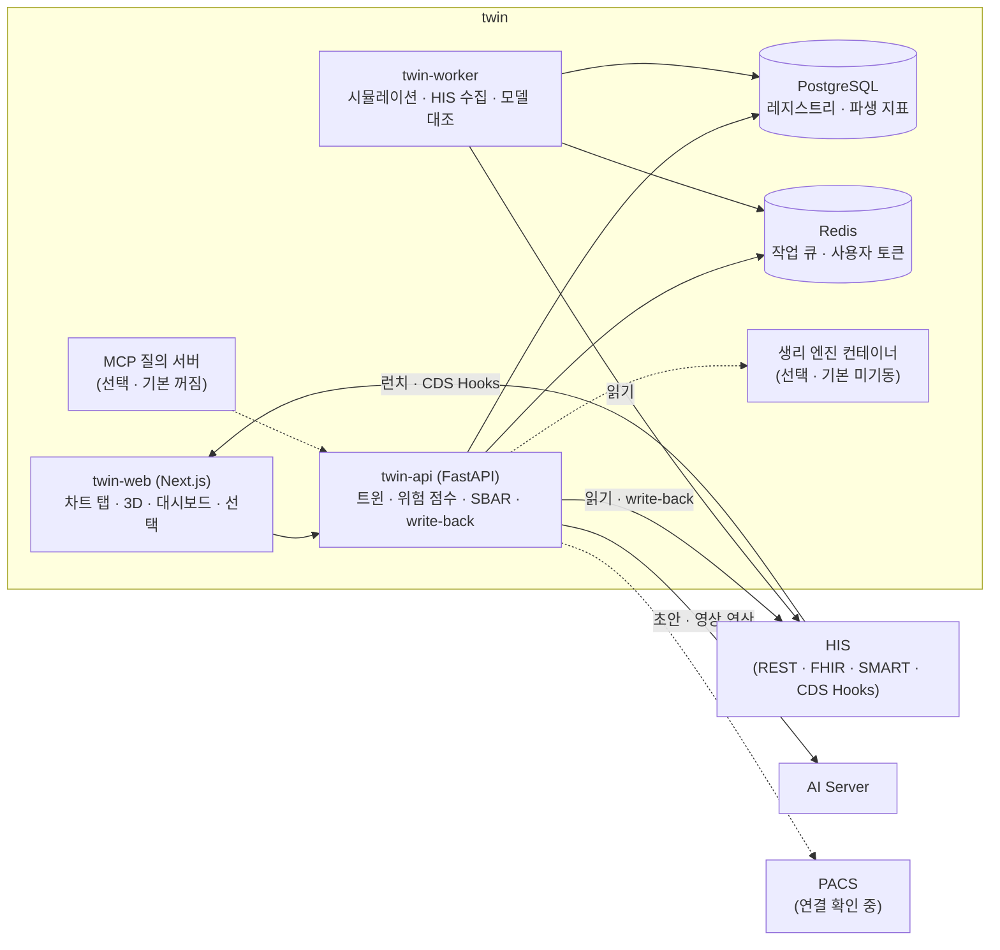

# twin — 시스템 구성서

> 기준 버전 **1.20.88** · 기준 커밋 `526b4f9a4d3f` · 구현 상태 `통합` — [매니페스트](../RELEASES/draft/manifest.md) 기준
> 사실 확인: 미확인 — 생태계 자료 측 조사 기준(시스템 담당 확인 전) · **이 시스템은 2026-09 따라가기에서 설치하지 않았습니다**(다른 7개 시스템은 설치해 연결을 확인했습니다)

이 버전에서 무엇이 바뀌었는지는 [릴리즈 요약](../RELEASES/draft/systems/twin.md)에 있습니다.

## 1. 정체성과 계층

- **정의**: 병원 운영 · 기기 · 환자를 모델로 옮겨 위험 점수 카드 · SBAR · What-if 시뮬레이션 · 3D 시각화를 제공하는 디지털 트윈 서비스입니다.
- **계층**: AI 계층(위험 예측 · 시뮬레이션). 구축 단계로는 [S6 AI 계층](../README.md#구축은-이렇게-진행됩니다)에서 붙입니다.
- **HIS 와의 관계**: HIS 의 자료를 **읽어서** 쓰는 별도 서비스입니다. 환자 상세는 조회할 때 HIS 에서 받아 오고, 트윈 DB 에는 파생 지표 · 집계만 둡니다. HIS 에 쓰는 것은 위험 평가 · SBAR · 임상의가 작성한 SOAP 의 write-back 뿐이며, 의료진이 화면에서 저장을 눌렀을 때 그 사용자의 권한으로 보냅니다.
- **AI Server 와의 관계**: 트윈 서버에는 GPU 가 없습니다. 임상 설명 초안 · 영상 연산 같은 무거운 일은 AI Server 에 맡깁니다.
- **버전 표기**: 코드 선언은 1.20.88 이고, 저장소의 마지막 태그는 v1.20.72 입니다(매니페스트 등급 `주요`). 웹 패키지는 1.6.1 로 따로 매겨지며 시스템 버전으로 쓰지 않습니다.

## 2. 구성도

## 3. 규모

| 항목(스냅샷 키) | 값 | 센 방법(요약) | 계측일 |
|---|---:|---|---|
| `systems.twin.counts.apiEndpoints` | 107 | `services/twin/twin/**` 에서 FastAPI 라우터 변수의 HTTP 데코레이터 수(= 핸들러 수) · 웹소켓 제외 | 2026-09-11 |
| `systems.twin.counts.pages` | 15 | `services/twin-web/app/**/page.*` 파일 수(레이아웃 · 오류 화면 · API 라우트 제외) | 2026-09-11 |
| `systems.twin.counts.testCases` | 881 | `services/twin/tests/**/test_*.py` 의 테스트 함수 선언 수(매개변수로 늘어나는 실행 건수 제외) | 2026-09-11 |

원본과 규칙 전문: [`data/scale-snapshot.json`](../data/scale-snapshot.json) · 기준 커밋 `526b4f9a4d3f`.

## 4. 핵심 기능

| 영역 | 무엇을 하나 |
|---|---|
| 운영 트윈 | 병상 · 중환자실 · 응급실 · 수술실의 점유 · 회전 · 부하 지표 · 이산사건 시뮬레이션으로 병상 증설 · 인력 변경 What-if · 필요한 최소 인력 · 병상 수 탐색 · 병동 단위 위험 분포 · 기기 트윈(예지 정비 위험 · 점검 준수) |
| 환자 위험 점수 카드 | 공표된 임상 점수 · 위험 모델을 카드로 보여줍니다 — 심혈관 · 신장 · 조기 경보(NEWS2) · 정맥혈전색전증 · 폐색전증 중증도 · 간 · 폐렴 · 심방세동 · 소화기 출혈 · 급성 췌장염. 카드마다 계산식 · 변수 · 등급 · 적용 범위 · 원 논문 인용을 펼쳐 볼 수 있고, 모든 모델은 모델 카탈로그에 등재돼야 합니다 |
| 임상 입력 | 자동으로 채운 입력을 임상의가 화면에서 고칠 수 있습니다(그 조회에만 적용 · 저장 안 함). 빠진 입력은 0 으로 채우지 않고 "입력 필요"로 표시합니다 |
| 치료 중재 What-if | 금연 · 혈압 · 혈당 · 스타틴 같은 중재의 효과를 여러 모델로 비교합니다 |
| 임상 문서 · HIS 반영 | SBAR 는 규칙 기반으로 만듭니다(LLM 을 쓰지 않음). 위험 평가 · SBAR · SOAP 를 FHIR 자원으로 HIS 에 write-back 하고, 보내기 전에 FHIR 규격 검증을 거칩니다. CDS Hooks 카드로 HIS 차트에 위험 정보를 보냅니다 |
| 환자 아바타 | 다장기 메시 · 심장 전기생리 시각화 · 생리 엔진 예후 What-if(무거운 연산은 AI Server 또는 별도 컨테이너) |
| 외부 질의(선택) | 트윈의 읽기 기능을 MCP(Model Context Protocol) 도구로 노출합니다 |
| 관측 · 거버넌스 | 환자 정보 조회 감사 로그 · Prometheus 지표 · 요청별 지연과 HIS 호출 수 계측 · 사용하는 LLM 모델 교체 감지 알림 |

## 5. 설치 요구사항

| 항목 | 요구 |
|---|---|
| 구성 | Docker Compose — API · 워커 · PostgreSQL · Redis 가 기본이고, 웹 화면(`web` 프로파일)과 생리 엔진(`pulse` 프로파일)은 선택입니다 |
| 런타임 | API · 워커 Python 3.12(컨테이너) · 웹 Node.js 22(Next.js 15 · 컨테이너) |
| DB · 캐시 | PostgreSQL 16 · Redis 7 — **Redis 비밀번호는 필수**이며, 설정하지 않으면 기동하지 않습니다. DB 는 Alembic 마이그레이션으로 올립니다 |
| GPU | 트윈 서버에는 필요 없습니다. 아바타 · 영상 메시 · 심장 전기생리 · 임상 설명 초안은 [AI Server](ai-server.md)가 있어야 동작합니다 |
| 저장소 | 트윈 DB 볼륨 · Redis 볼륨. 필요한 용량은 계측해 싣습니다 |
| 네트워크 | HIS(REST · FHIR) · AI Server 로 나가는 연결. 웹을 외부에 열 때는 허용할 출처(CORS)를 정합니다 |
| 함께 준비할 것 | **HIS 쪽** — SMART 클라이언트 등록(사용자 런치 · 시스템 범위 읽기) · 트윈 전용 읽기 서비스 계정 · 동의 조회 API. HIS 가 발급하는 id_token 에 `iss` · `aud` · `exp` 가 있어야 합니다. **AI Server 쪽** — 호출 키 |

## 6. 주요 설정

설정 파일 `.env`(예시 `.env.example`)와 서비스 설정 항목입니다. 설정 항목 이름은 소문자로 적었고, 환경변수로 줄 때는 대문자로 씁니다. 값은 자리표시로 생각하십시오.

| 묶음 | 키 | 뜻 | 설치 전 |
|---|---|---|---|
| 트윈 DB · 캐시 | `TWIN_DB_USER` · `TWIN_DB_PASSWORD` · `TWIN_DB_NAME` · `TWIN_DATABASE_URL` · `TWIN_REDIS_PASSWORD` · `TWIN_REDIS_URL` | 트윈 자체 DB · Redis 접속(비밀값 포함) | **반드시 바꿀 것** |
| API 보호 | `TWIN_API_KEY` · `TWIN_CORS_ORIGINS` | 보호된 API 의 키 · 허용 출처 | **반드시 바꿀 것** |
| 공개 주소 | `TWIN_PUBLIC_BASE` · `PUBLIC_TWIN_API_BASE` | 트윈 웹 · API 의 공개 주소 | **반드시 바꿀 것** |
| HIS 연결 | `HIS_BASE_URL` · `HIS_FHIR_BASE_URL` · `HIS_SERVICE_EMAIL` · `HIS_SERVICE_PASSWORD` · `HIS_API_TOKEN` | HIS 주소 · FHIR 주소 · 트윈 전용 읽기 서비스 계정 | **반드시 바꿀 것** |
| SMART | `TWIN_SMART_CLIENT_ID` · `TWIN_SMART_CLIENT_SECRET` · `his_smart_read_client_id` · `his_smart_read_client_secret` · `his_smart_read_scopes` | 사용자 런치용 클라이언트 · 시스템 범위 읽기(SMART Backend Services)용 클라이언트와 범위 | **반드시 바꿀 것** |
| 런치 | `twin_launch_secret` | 구방식 런치 링크 서명 키(비밀값) | **반드시 바꿀 것** |
| AI Server | `AI_BASE_URL` · `AI_API_KEY` · `AI_MEDICAL_KEY` | AI Server 주소 · 호출 키 | **반드시 바꿀 것** |
| 모델 고정 | `ai_chat_model` · `ai_chat_model_digest` · `llm_model_check_hours` · `ai_chat_temperature` · `ai_chat_top_p` · `ai_chat_seed` · `ai_chat_max_tokens` | 대화 모델 이름과 digest 고정 · AI Server 와 대조하는 주기(기본 6시간마다) · 추론 파라미터 고정 | 받은 모델에 맞춤 |
| PACS | `ORTHANC_DICOMWEB_URL` · `ORTHANC_USERNAME` · `ORTHANC_PASSWORD` | 영상 조회 주소 · 계정(연결 상태는 확인 중) | 쓰면 **반드시 바꿀 것** |
| 운영 | `INGEST_INTERVAL_SEC` · `SIM_MAX_CONCURRENT` · `TWIN_LOG_LEVEL` · `TWIN_ALERT_WEBHOOK` | HIS 수집 주기 · 동시 시뮬레이션 수 · 로그 수준 · 알림 웹훅(선택) | 정할 것 |

**기본값이 꺼져 있어 운영 전에 켤지 정해야 하는 스위치**([릴리즈 요약](../RELEASES/draft/systems/twin.md) 기준)

| 키 | 뜻 | 기본 |
|---|---|---|
| `patient_require_consent` | 환자 동의를 요구합니다. 저장소 설정 주석은 동의 운영을 확인한 뒤 켜기를 권장합니다 | 꺼짐 |
| `twin_identity_enforce` | 웹과 API 사이 신원 서명 검증을 강제합니다. **운영 전에 켭니다** | 꺼짐 |
| `mcp_enabled` | MCP 질의 서버. 켜면 `mcp_deidentify`(기본 켜짐)로 응답의 직접 식별자를 가립니다 | 꺼짐 |
| `pulse_enabled` | 생리 엔진 예후 What-if(별도 컨테이너) | 꺼짐 |

그 밖의 AI 관련 스위치(`evidence_enabled` 근거 인용 · `avatar_enabled` 환자 아바타)도 기관이 켤지 정합니다.

## 7. 연동

연결 상태는 [연결 상태](../RELEASES/draft/compatibility.md)에서 가져왔습니다(코드 대조 · 2026-09-11 · 실제 호출 확인 전).

**들어오는 연결 3 · 나가는 연결 4** — 모두 `구현·미검증`

| 방향 | 목적(요약) | 상태 |
|---|---|---|
| HIS → twin | 트윈 보기 — 서명된 런치 링크(구방식) | `구현·미검증` |
| HIS → twin | SMART on FHIR EHR 런치 — 의료진 + 환자 바인딩 | `구현·미검증` |
| HIS → twin | CDS Hooks — 차트 열람 시 트윈 위험 카드 | `구현·미검증` |
| twin → HIS | 환자 트윈 FHIR 읽기(환자 · 진단명 · 검사 · 처방 · 알레르기 · 내원 · 시술) — 위험 점수 산출용 | `구현·미검증` |
| twin → HIS | 운영 트윈 조회(병상 · 병동 · 재원 · 운영 통계 · 의료기기 · 중환자실 · 응급실 · 수술실)와 트윈 전용 조회(AI 활용 동의 · 활력 · 영상 목록) | `구현·미검증` |
| twin → HIS | FHIR write-back — 위험 평가 · SBAR/SOAP 문서를 의료진의 저장 동작으로 HIS 에 저장 | `구현·미검증` |
| twin → AI Server | 위험 예측 보조 · 약물 상호작용 · DUR · 서술형 요약 · 의료법 질의 · 영상 연산 | `구현·미검증` |

- 표에 없는 연결: twin → PACS — 확인 중.
- 시스템 담당 확인을 기다리는 연결은 이 장에 싣지 않았습니다([연결 상태](../RELEASES/draft/compatibility.md)).

## 8. 표준과 규제

- **표준**: FHIR R4(읽기 · write-back 전 규격 검증) · SMART App Launch(EHR 런치 · PKCE) · SMART Backend Services(시스템 범위 읽기) · CDS Hooks · MCP · Prometheus 지표. 검사 코드 매핑에 LOINC 를 씁니다(이용 조건은 [THIRD_PARTY §4](../THIRD_PARTY.md#4-코드-마스터기준-데이터)에서 확인 중).
- **규제 산출물**: SBOM · SOUP 목록 · V&V 프로토콜 · FMEA · 변경 계획(PCCP) 초안이 저장소에 있습니다. 이 자료에서는 **`대응 설계`** 로 적습니다.
- 안전 등급 분류는 예비 단계이고, 의료기기 해당성 · 유형 판단은 확정되지 않았습니다. 판단과 인허가는 구축 기관이 합니다([의료 면책 고지](../DISCLAIMER.md)).

## 9. AI 사용

- **정량 산출은 LLM 을 거치지 않습니다.** 위험 점수 · NEWS2 · eGFR 은 공표된 계산식으로 산출하고, SBAR 는 규칙 기반입니다.
- **AI 가 돕는 곳** — 임상 설명 초안 · 영상 판독 초안 · 근거 문서 인용 · 환자 아바타 연산. AI Server 의 모델을 씁니다.
- **초안 · 사람 승인** — AI 출력은 `machine-generated` 로 표시되고 **의무기록에 직접 기록되지 않습니다**. HIS 로 가는 write-back 은 의료진이 화면에서 저장했을 때만 일어나며, 동의가 필요하다는 응답을 받으면 저장하지 않고 사유를 표시합니다(저장소 문서 기준).
- **모델 고정** — 대화 모델 이름과 digest 를 설정으로 고정하고, 주기적으로 AI Server 와 대조해 바뀌면 알립니다. 다른 모델을 쓰려면 설정을 바꾸고 저장소의 변경 절차(PCCP)에 따라 검증 스크립트를 다시 돌립니다.
- **모델 약관** — 기본으로 가리키는 모델과 약관은 [THIRD_PARTY §3](../THIRD_PARTY.md#3-ai-모델-가중치)에 있습니다.

## 10. 한계와 대체 수단

| 한계 | 대체 수단 · 준비 |
|---|---|
| 의료기기 해당성 · 유형 판단이 확정되지 않았습니다 | 구축 기관이 관할 규정에 따라 판단합니다 |
| 저장소의 FMEA 는 AI 관련 고장 모드 중 자동화 편향 · 데이터 편향 두 항목을 "조치 필요"로 분류합니다(원인: 정량 검증 미실시) | 구축 기관이 정량 검증 계획을 세웁니다. 그 전까지 AI 출력은 의무기록에 직접 기록되지 않는 참고 초안입니다 |
| 트윈 서버 자체에는 GPU 가 없어, 아바타 · 영상 연산은 AI Server 없이는 동작하지 않습니다 | 위험 점수 · SBAR 는 LLM 을 거치지 않는 계산이라 AI Server 와 따로 쓸 수 있게 되어 있습니다(새 설치본으로 확인 예정) |
| 장기 · 생체 3D 트윈은 설계 단계입니다 | 별도 GPU · 고성능 연산 자원이 있어야 진행할 수 있습니다 |
| 일부 입력(수술 · 시술 세부 · 혈전성향 검사 · 이동성 등)은 자동으로 채워지지 않을 수 있습니다 | 화면의 임상 입력으로 받거나 "미평가"로 표시합니다. 흡연 상태가 없으면 가정값을 쓰고 가정했다는 표시를 붙입니다 |
| AI 가 인용한 근거 문서의 URL · DOI 표시는 AI Server 쪽 근거 자료 구성에 따라 달라집니다 | 기관이 넣는 근거 자료에 출처 정보를 함께 담습니다 |
| 연결별 동작은 코드 대조까지만 판정했습니다 | 새 설치본으로 실제 호출해 `검증됨` 을 붙입니다 |

## 11. 소스 · 라이선스 표기 · 확인일

- **소스 링크**: 정리 중
- **저장소 라이선스 표기**: 표기 없음 — [매니페스트](../RELEASES/draft/manifest.md) 기준(생태계 소프트웨어는 MIT 로 제공하는 것이 목표이며 표기는 정리 중입니다)
- **제3자 구성요소**: [THIRD_PARTY.md](../THIRD_PARTY.md) — PostgreSQL · Redis(판본에 따라 약관이 다름) · Pulse Physiology Engine(선택) · Synthea(검증용 합성 데이터)
- **확인일**: 2026-09-11 — 기준 커밋 `526b4f9a4d3f` 의 코드 · 설정 예시 · 저장소 문서를 읽어 작성했습니다
